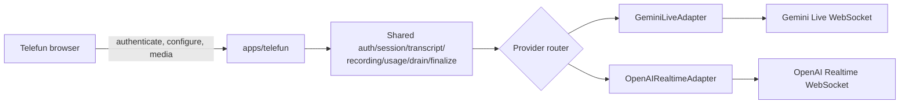

# ADR: Telefun Realtime Provider Adapters

- **Status:** Accepted for phased implementation
- **Date:** 2026-07-17
- **Rollout baseline:** Gemini-only; OpenAI feature flag off

## Context

Telefun produksi saat ini memakai satu WebSocket proxy Node (`apps/telefun`) yang mengautentikasi user/session, membuka Gemini Live, mengelola transcript, turn state, recording, usage, drain, dan finalisasi. Browser mengirim payload Gemini setelah `auth_ok`.

Requirement target menambahkan [`gpt-realtime-2.1`](https://developers.openai.com/api/docs/models/gpt-realtime-2.1) dan [`gpt-realtime-2.1-mini`](https://developers.openai.com/api/docs/models/gpt-realtime-2.1-mini) sebagai opsi paralel tanpa mengganti default Gemini atau memindahkan secret ke browser. Dokumentasi ini mendahului runtime/schema; provider router dan OpenAI adapter belum berjalan saat ADR diterima.

## Decision

Telefun mempertahankan **satu authenticated WebSocket proxy** dan menempatkan data plane provider di balik adapter:

Browser mengirim satu `telefun_session_configure` setelah `auth_ok` dan sebelum media. Proxy memvalidasi pasangan model/transport, voice, instructions, PCM format/rate, pacing mode, batas durasi, dan feature flag terhadap registry/allowlist kanonik sebelum membuka upstream. Control messages Telefun tidak diteruskan ke provider.

Key provider hanya berada di service Telefun. OpenAI upstream menggunakan `wss://api.openai.com/v1/realtime?model=<allowlisted-model>` dengan Bearer authorization backend. Model ID client tidak pernah dirangkai ke URL sebelum validasi allowlist.

Kontrak envelope, lifecycle, dan acceptance matrix normatif ada di [`docs/telefun.md`](../telefun.md#kontrak-kontrol-provider-neutral-target).

## Reasons

- Mempertahankan API key dan Bearer authorization di backend; tidak ada long-lived key atau ephemeral-token minting surface di browser.
- Menggunakan ulang trust boundary auth Supabase dan ownership session yang sudah ada.
- Menggunakan ulang lifecycle transcript, speaker semantics, recording, usage, drain, finalization, history, dan review yang sudah matang.
- Menjaga satu endpoint browser dan satu contract control plane, sementara event/payload provider-specific terisolasi di adapter.
- Memungkinkan kill switch OpenAI tanpa menghapus history atau mengganti default Gemini.

## Alternatives considered

### Browser-direct WebRTC dengan ephemeral token

Tidak dipilih untuk fase ini. Jalur tersebut menambah token-minting endpoint, browser/provider session lifecycle, observability path, dan security boundary baru. Telefun tetap membutuhkan proxy/server lifecycle untuk session ownership, transcript, recording, usage, serta finalisasi; browser-direct tidak menghilangkan tanggung jawab tersebut.

### Mengganti Gemini dengan OpenAI

Tidak dipilih. Gemini adalah provider produksi dan default yang sudah terkarakterisasi. Replacement meningkatkan blast radius, menghilangkan rollback sederhana, dan memaksa semantics reconnect/resumption berbeda ke semua user sekaligus.

### Satu protocol data plane generik untuk semua provider

Tidak dipilih. Control plane dapat provider-neutral, tetapi payload audio, transcript, interruption, completion, usage, VAD, dan reconnect berbeda. Memaksa event provider ke satu raw schema akan membocorkan detail vendor atau menghilangkan semantics penting.

## Consequences

### Positive

- Browser dan shared Telefun lifecycle tetap stabil.
- Adapter dapat diuji dengan fake upstream secara independen.
- Provider/model/voice/audio/pricing dapat divalidasi dan diobservasi secara eksplisit.
- Rollback operasional cukup menonaktifkan OpenAI untuk sesi baru.

### Trade-offs and required behavior

- Ada dua data plane provider-specific yang harus dipelihara di balik interface adapter.
- Gemini mempertahankan session resumption yang ada. OpenAI tidak diklaim resumable: reconnect membuat sesi upstream baru yang **discontinuous** dan harus terlihat jujur di status/telemetry.
- Tidak ada mid-call fallback. Auth, config, quota, network, atau upstream failure dilaporkan sesuai provider; panggilan tidak diam-diam dipindahkan ke provider lain.
- OpenAI memakai PCM16 24 kHz, baseline [`server_vad`](https://developers.openai.com/api/docs/guides/realtime-vad), maksimum sesi 60 menit, dan voice tidak dapat berubah setelah model menghasilkan audio.
- OpenAI `session.update` menggunakan `session.type = "realtime"`, `output_modalities`, serta `audio.input` / `audio.output` bertingkat. Lihat [Realtime WebSocket](https://developers.openai.com/api/docs/guides/realtime-websocket) dan [Realtime conversations/events](https://developers.openai.com/api/docs/guides/realtime-conversations).
- Usage OpenAI dihitung dari `response.done` yang didedupe berdasarkan response ID. Metadata usage yang hilang tidak boleh menghasilkan token/cost rekaan atau fallback billing Gemini.
- Tool dispatcher provider-neutral berada di backend dan menangani deduplikasi call ID serta output/error aman untuk Gemini/OpenAI. Registry produksi tetap kosong; tool baru hanya dapat aktif melalui definisi bisnis bernama dengan JSON Schema, Zod schema, dan handler allowlisted eksplisit.

## Rollout and rollback

1. Land dokumentasi/control contract terlebih dahulu.
2. Tambahkan registry, validation, voice/audio config, adapter, schema pricing/usage, health, dan test secara additive.
3. Deploy dengan Gemini tetap default dan `TELEFUN_OPENAI_ENABLED=false`.
4. Verifikasi liveness/readiness tanpa koneksi provider berbayar; gunakan fake upstream untuk CI.
5. Enable OpenAI hanya jika `OPENAI_API_KEY` tersedia di service Telefun dan seluruh acceptance gate lulus.
6. Rollback dengan `TELEFUN_OPENAI_ENABLED=false`. History/provider/model metadata dan schema additive tetap dipertahankan.

Routine health check tidak membuka upstream berbayar. Flag off atau readiness OpenAI gagal harus menolak configure OpenAI secara aman tanpa memengaruhi sesi Gemini baru.
