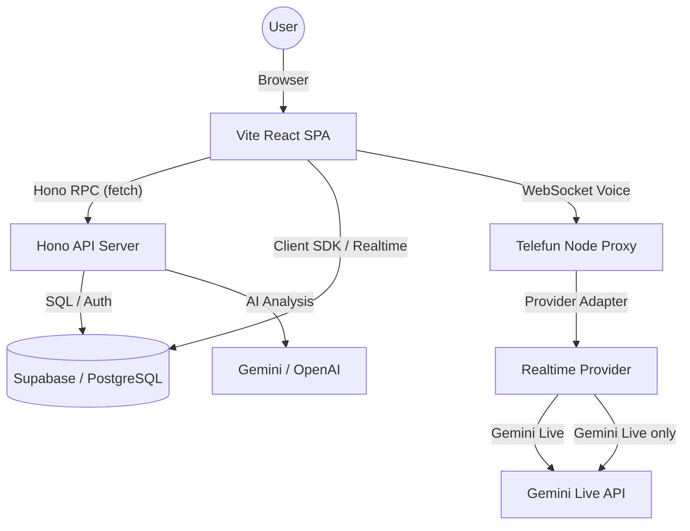

# System Architecture

> **Telefun status:** Gemini Live is the only active Telefun realtime provider. GPT/OpenAI Realtime Telefun work is concluded and permanently disabled for all users. Historical OpenAI rows remain readable for review, recording, usage, and read-only pricing; only authenticated owner-bound DELETE cleanup for an already-bound historical WebRTC call remains. Direct OpenAI text provider architecture outside Telefun remains enabled.

Dokumen ini menjelaskan arsitektur teknis, tumpukan teknologi, dan struktur direktori proyek Trainers SuperApp (Monorepo Rebuild).

## Tech Stack

Aplikasi ini dibangun menggunakan arsitektur monorepo modern dengan pemisahan frontend dan backend yang jelas:

- **Monorepo Tool**: [Turborepo](https://turbo.build/) + [pnpm](https://pnpm.io/)
- **Frontend**: [Vite](https://vitejs.dev/) + [React 19](https://react.dev/) + [TanStack Router v1](https://tanstack.com/router)
- **Backend**: [Hono](https://hono.dev/) (Node.js API server)
- **Bahasa**: [TypeScript](https://www.typescriptlang.org/)
- **Styling**: [Tailwind CSS 4](https://tailwindcss.com/)
- **Backend as a Service**: [Supabase](https://supabase.com/) (Auth, PostgreSQL, RLS, Storage)
- **Animasi**: [Framer Motion / Motion](https://www.framer.com/motion/)
- **Visualisasi Data**: [Recharts](https://recharts.org/)
- **Ikon**: [Lucide React](https://lucide.dev/)
- **API Type Safety**: Hono RPC (`hc<AppType>`) untuk full type-safety antara frontend dan backend
- **Validasi**: [Zod](https://zod.dev/) (shared schemas di `packages/types`)

## High-Level Architecture

Production host ownership is split: `apps/web` is canonical on Vercel, while
`apps/api` and `apps/telefun` remain canonical Railway services. Railway Web is
an allowed normal STAGING target; only a Railway Web PRODUCTION deployment is
auxiliary/noncanonical and cannot by itself prove the Vercel Web release state.



### Penjelasan Alur:

1. **Frontend (`apps/web`)**: Vite + React SPA dengan TanStack Router. Semua route di-lazy load via `React.lazy()`.
2. **Backend (`apps/api`)**: Hono API server dengan route handlers di `src/routes/`. Business logic di `src/services/`.
3. **Hono RPC**: Frontend mengonsumsi API via `hc<AppType>` dari Hono RPC — full type-safety tanpa perlu definisi API terpisah.
4. **Supabase**: Menangani autentikasi user, penyimpanan data persisten, RLS, dan media Storage.
5. **RLS (Row Level Security)**: Memastikan keamanan data di tingkat database berdasarkan role user (Admin, Trainer, Leader, Agent).
6. **Telefun Proxy (`apps/telefun`)**: Service Node terpisah untuk memvalidasi token Supabase lalu meneruskan audio hanya ke Gemini Live. Metadata OpenAI Realtime yang tersisa adalah historical compatibility dan tidak menjadi provider adapter atau start path.
7. **AI Providers**: Modul simulasi dan laporan memakai provider abstraction server-side di backend (Hono) yang aktifnya hanya Gemini dan OpenAI direct. Semua AI calls dicatat ke `ai_usage_logs`.
8. **Shared Types (`packages/types`)**: Zod schemas dan TypeScript interfaces yang dipakai bersama oleh frontend dan backend.

### Telefun realtime boundary (Gemini-only; historical cleanup retained)

- **Baseline produksi**: `LiveSession`/`GeminiLiveAdapter` adalah satu-satunya Telefun live runtime; historical `openai-audio`/`openai-webrtc` values are normalized before browser start.
- **Historical WebRTC cleanup only**: `apps/web/src/routes/telefun/services/openaiWebRtc/` tidak menyediakan POST/SDP/start. DELETE owner-bound tetap tersedia untuk already-bound historical calls.
- **Single-flight session creation**: landing Telefun coalesces overlapping Gemini session creation before `POST /telefun/sessions`; startup never consults an OpenAI capability.
- **Archived internal extraction**: old OpenAI observer/tool/sideband material is retained only as historical implementation evidence. It is unwired from active Telefun runtime.
- **Retired data plane**: browser WebRTC media, SDP POST, sideband, and OpenAI scoring are permanently disabled; no new provider call is possible.
- **Prompt/context authority**: the Gemini context builder is the active browser/runtime path. Historical WebRTC prompt metadata is readable evidence only and is never used to construct a provider session.
- **Permanent guardrail**: all `TELEFUN_OPENAI*` rollout/cohort/model inputs are retired no-ops. POST remains 404; authenticated owner-bound DELETE is the narrow cleanup exception. No paid/manual provider smoke is evidence for this change.

### Historical WebRTC cleanup boundary

The durable WebRTC boundary is retained only for historical cleanup. An
exact-origin authenticated owner `DELETE` reads a server-only encrypted
provider reference, decrypts and validates an existing call ID, then issues a
hangup and durable terminalization. It cannot create calls, construct SDP, open
a sideband, write usage, or score audio.

`204` means durable terminalization (or proven no-attempt terminalization).
Missing/invalid key or reference, failed hangup, and durability errors remain
retryable and return `503`; lifecycle conflict remains `409`. Historical
recordings, assessments, and usage snapshots stay readable under their existing
owner/RLS rules. Terminal uncached historical scoring is permanently suppressed,
not requeued.

### Archived pre-retirement Phase 5 WebRTC notes (not runtime guidance)

> The material in this subsection records the former production-hardening
> candidate. It is archived evidence only: no described lease, sideband,
> network-recovery, broker-start, or provider-admission path is active.

- `telefun_realtime_leases` menjadi authority quota/concurrency lintas replica. Claim, renew, release, expiry cleanup, dan provider/user cap dijalankan melalui RPC atomic; binding in-memory hanya cache untuk routing provider. Kehilangan lease memicu provider hangup/finalisasi `network_lost`, lalu release bertoken tetap dicoba agar row terminal tidak menunggu orphan sweep.
- Renewal coordinator mengklasifikasikan kehilangan authority secara bounded sebagai `local_expiry`, `rpc_error`, `invalid_response`, closed RPC reason, atau `renewal_rejected`; raw exception/reason tidak diteruskan. Migration `20260811044655` mengualifikasi `lease.expires_at`, mengambil row lock, dan memisahkan `lease_not_found`/`owner_mismatch`/`inactive`/`expired`/`invalid_ttl`. Database production canonical sudah memuat dan memverifikasi function repair ini; candidate aplikasi dengan reason taxonomy baru masih memerlukan staging deploy.
- `telefun_realtime_rate_limits` memakai scope user/session/provider dan window atomic di database. Kegagalan RPC limiter bersifat fail-closed untuk jalur WebRTC.
- Orphan cleanup worker meng-claim lease stale setelah restart, menutup provider reference dan sideband secara bounded, lalu menulis outcome `orphaned`. Outcome lifecycle yang didukung adalah `completed`, `failed`, `network_lost`, dan `orphaned`.
- Recovery browser/network tidak melakukan silent recreate. Recreate yang disetujui harus menghasilkan attempt/session boundary baru dan `discontinuity` yang dapat direkonsiliasi; kegagalan network dikirim sebagai `network_lost`.
- Provider call ID disimpan sebagai encrypted opaque reference server-side. Browser hanya menerima session/attempt boundary dan pesan aman; OpenAI key, provider secret, sideband URL, canonical config, SDP diagnostics, dan raw provider error tidak pernah diteruskan ke browser/log.
- Metric names dibatasi untuk cost reconciliation, sideband disconnect, duplicate write, missing usage, orphan, dan session cap. UUID user diubah menjadi SHA-256 `user_id_hash` sebelum persistence; missing/unpriceable usage tetap audit state, bukan biaya sintetis.

Historical OpenAI WebRTC rows have no production start deployment. `GET /health` remains non-billable and Gemini-readiness-only. Exact-origin authenticated DELETE cleanup remains server-owned; no provider start, sideband, scoring, or usage path is opened.

### Archived pre-retirement Phase 7 browser notes (not runtime guidance)

Phase 7 candidate menambahkan controller browser khusus untuk lifecycle output
OpenAI WebRTC. Controller membedakan response yang masih dibuat provider, output
buffer yang sedang dimainkan, dan elapsed media yang benar-benar maju. Server
tetap memiliki canonical session configuration (`server_vad` dengan
`interrupt_response=false`); browser tidak mengirim `session.update`.

Pada speech start, hanya response audible yang sudah mempunyai kemajuan playback
yang ditargetkan. Response yang masih in progress menerima scoped
`response.cancel`, kemudian output WebRTC di-clear. Pada transport WebRTC,
`output_audio_buffer.clear` menjadi authority truncation conversation; browser
tidak mengirim explicit `conversation.item.truncate` kedua dengan estimasi
`audio_end_ms`. Clear untuk response aktif hanya dikirim setelah scoped cancel
berhasil masuk DataChannel; kegagalan send membiarkan event berikutnya mencoba
ulang urutan cancel-then-clear. Event stale/duplicate dan rapid repeats dideduplikasi; autoplay
block, pause/stall/end, serta hold tidak dapat memicu interruption. DataChannel
browser tetap bukan persistence authority:
transcript/usage/finalization server-side tetap dimiliki sideband dan lifecycle
Phase 4–6.

Metrics server-VAD, hold, dan interruption ditutup pada finalization. Canonical
session mempertahankan `server_vad`, tetapi menetapkan `create_response=false`
dan `interrupt_response=false`: provider hanya memotong serta meng-commit audio,
sedangkan browser menjadi satu-satunya owner `response.create`. Speech start
menahan generation sampai event `input_audio_buffer.committed` dengan `item_id`
unik; commit itu kemudian meminta tepat satu response ber-marker internal bounded
di `response.metadata`.

Time cue tetap membuat system control item lebih dahulu. Jika cue berimpit dengan
turn VAD, response aktif, atau create yang belum diakui, event create lengkap
ditunda dan pending terakhir dicoalesce sambil mempertahankan `event_id`. Commit
VAD melepas barrier input dan memakai pending cue yang sama, sehingga satu
response melihat seluruh item conversation yang sudah committed. Semua
`response.created` ber-ID tetap dianggap aktif oleh interruption controller;
metadata absent/null, shape lain, atau marker mismatch adalah origin unknown dan
tidak pernah mengaku sebagai create Telefun. Hanya marker exact diikuti terminal
response yang sama yang melepaskan acknowledgement create. Shutdown membuang
seluruh pending/barrier secara sinkron. Kontrak single-owner ini menghilangkan
dual authority yang menghasilkan `conversation_already_has_active_response` pada
dua acceptance production sebelumnya. Recording memilih variant MediaRecorder
yang didukung dan mempertahankan MIME output aktual.

Single-owner menghilangkan collision response-create pada acceptance production
ketiga, tetapi call itu gagal setelah tiga response dan dua interruption dengan
provider code `invalid_value`. Sideband lama hanya mempertahankan code, jadi exact
provider `param` tidak tersedia. Korelasi timeline dan kontrak WebRTC menjadikan
double truncation (`output_audio_buffer.clear` lalu explicit item truncate)
kandidat terkuat; repair menghapus writer kedua dan mempertahankan hanya `param`
provider yang masuk allowlist bounded untuk diagnosis berikutnya. Live production
PASS setelah repair terbaru belum diklaim. Physical browser/device lintas browser,
Mini, dan keputusan deprecation OpenAI WebSocket tetap di luar evidence candidate
ini. Gemini dan legacy OpenAI WebSocket tidak diubah.

Untuk maintainability, browser orchestrator `openaiWebRtcSession.ts` dibatasi
menjadi 999 baris pada merge-preparation. Response-create arbitration, connect
diagnostics, session metrics, dan recording callback/URL ownership hidup di
controller/helper terpisah. Ekstraksi ini mempertahankan kontrak provider-free
yang sama dan tidak mengubah feature flag atau transport default.

History list/detail untuk sesi `openai-webrtc` berstatus `completed`
memproyeksikan field `feedback` secara deterministik dari `voice_assessment`
tervalidasi ketika kolom legacy `feedback` kosong. Nilai feedback yang sudah
dipersist tetap menang. Ini membuat hasil worker WebRTC—yang
menyimpan assessment lewat RPC service-role—terlihat setara pada ReviewModal
tanpa memberi browser authority menulis scoring.

## Directory Structure

Struktur folder monorepo:

```text
├── apps/
│   ├── web/                    # Frontend Vite + React + TanStack Router
│   │   ├── src/
│   │   │   ├── routes/         # Page components per module (37 routes, all React.lazy())
│   │   │   ├── components/     # Shared UI components (Layout, Sidebar, dll)
│   │   │   ├── hooks/          # Custom React hooks
│   │   │   ├── lib/            # Utilities, API client (Hono RPC), config
│   │   │   └── router.tsx      # Centralized TanStack Router v1 route definitions
│   │   ├── index.html          # Entry point dengan resource hints
│   │   └── vite.config.ts      # Vite config dengan code splitting
│   ├── api/                    # Backend Hono API server
│   │   ├── src/
│   │   │   ├── routes/         # Hono route handlers — decomposed per module:
│   │   │   │   ├── sidak.ts    #   barrel (import + route registration 5 sub-modules)
│   │   │   │   ├── sidak/      #   sub-modules: core, dashboard, temuan, rule-versions, reports
│   │   │   │   ├── telefun.ts  #   barrel (import + route registration 4 sub-modules)
│   │   │   │   ├── telefun/    #   sub-modules: sessions, recordings, settings, annotations
│   │   │   │   ├── ketik.ts    #   KETIK endpoints
│   │   │   │   ├── pdkt.ts     #   barrel (re-export from ./pdkt/index)
│   │   │   │   ├── pdkt/       #   sub-modules: index, simulation, mailbox, history, settings, route-utils
│   │   │   │   ├── ai.ts       #   AI monitoring endpoints
│   │   │   │   ├── profiler.ts #   Profiler endpoints
│   │   │   │   └── admin.ts    #   Admin endpoints
│   │   │   ├── services/       # Business logic — decomposed per module:
│   │   │   │   ├── sidak-service.ts   # barrel (14+ sub-modules: shared-constants, access-scope,
│   │   │   │   │                   #   period-indicator, temuan-service, agent-directory,
│   │   │   │   │                   #   rule-versions, service-trends, dashboard-*, report-*,
│   │   │   │   │                   #   dashboard-forecast)
│   │   │   │   ├── sidak/            #   SIDAK sub-modules
│   │   │   │   ├── sidak-ranking-service.ts  #   Ranking extraction
│   │   │   │   ├── ketik-service.ts
│   │   │   │   ├── pdkt-service.ts  #   barrel (re-export 5 sub-modules + ai-json)
│   │   │   │   ├── pdkt/            #   PDKT sub-modules: catalog, session, evaluation,
│   │   │   │   │                   #   mailbox, shared-utils, image-generation, mailbox-session
│   │   │   │   ├── profiler-service.ts
│   │   │   │   ├── admin-service.ts
│   │   │   │   ├── monitoring-history-service.ts
│   │   │   │   └── activity-log-service.ts
│   │   │   ├── lib/            # AI models, scoring, usage logging, Supabase clients,
│   │   │   │                   #   math-utils, telefun-communication-profile, report builders
│   │   │   ├── middleware/      # auth, role, rate-limit middleware
│   │   │   └── index.ts        # Hono app entry point + AppType export
│   │   └── vitest.config.ts    # API test config
│   └── telefun/                # Gemini Live WebSocket proxy plus historical cleanup compatibility
│       ├── src/                # Server, auth, usage, env handling
│       └── src/realtime-webrtc/ # Owner-bound historical encrypted-reference cleanup modules
├── packages/
│   └── types/                  # Shared Zod schemas & TypeScript interfaces
│       └── src/                # 8 domain files + barrel index.ts (common, sidak, ketik, pdkt, telefun, ai, profiler, admin)
├── reference-repo/             # Sumber referensi logic dari codebase lama (Next.js)
│   ├── app/                    # Next.js App Router (referensi saja)
│   └── docs/                   # Dokumentasi legacy (referensi)
├── supabase/
│   └── migrations/             # DB schemas (000 profiles, 001 SIDAK, 002 KETIK/PDKT/AI, 003 Telefun, 004 Admin, 005 carbon copy, 006 user settings, 007 report archives, 008 profile admin policies, 009 storage RLS, 010 activity_logs index)
├── docs/                       # Dokumentasi teknis sistem
│   ├── rebuild-logs/           # Per-phase completion logs (phase-1 onward, including current profiler fixes)
│   └── superpowers/            # Plans dan specs dari superpowers skills
├── opencode.json               # Project-level opencode config dengan context7 MCP
├── AGENTS.md                   # Panduan development untuk AI agents
└── package.json                # Root package.json (pnpm workspace + Turborepo)
```

## Data Flow Pattern

Proyek ini mengutamakan pola **Centralized Service Layer** di backend:

- Logic database tidak diletakkan langsung di dalam komponen UI frontend.
- Semua query kompleks berada di `apps/api/src/services/` (contoh: `sidak-service.ts` — barrel dari 13 sub-modules, `profiler-service.ts`).
- Route handlers didekomposisi per modul: sub-modul di `apps/api/src/routes/sidak/` (5 file), `apps/api/src/routes/telefun/` (4 file), dan `apps/api/src/routes/pdkt/` (6 file), dengan barrel file `sidak.ts`/`telefun.ts`/`pdkt.ts` sebagai entry point.
- Frontend mengonsumsi API via Hono RPC client (`hc<AppType>`) untuk full type-safety.
- Hybrid Client Pattern untuk Supabase:
  - Default: Gunakan User JWT untuk menghormati RLS.
  - Admin Client (Service Role): Hanya di backend untuk AI logging, background jobs, dan heavy reports.
- Monitoring lintas akun dan usage billing menggunakan server-side access via admin client, bukan direct browser read terhadap tabel sensitif.
- History simulasi KETIK/PDKT menggunakan tabel modul masing-masing sebagai sumber utama.
- Module settings (KETIK, PDKT, Telefun) disimpan namespaced di `user_settings.settings.<module>` agar tidak saling timpa. Setiap modul wajib membaca existing settings sebelum menulis.
- **SIDAK Dashboard Performance**: Endpoint dashboard utama menghitung ringkasan secara real-time dari data temuan mentah via scoring engine aplikasi. Materialized view (`mv_qa_period_summary`) dan tabel cache/summary (`qa_dashboard_period_summary`) dipelihara terpisah untuk kompatibilitas database, workflows backfill, dan offline analytics, namun tidak digunakan pada read-path dashboard utama.
- **SIDAK Dashboard Forecast**: Prediksi dashboard menggunakan batch forecast persistence dengan SHA-256 fingerprinting. 3-state lifecycle (`missing`/`fresh`/`stale`) dengan visual attention effects. Angka menggunakan regresi linear deterministik, narasi menggunakan Gemini 3.1 Flash Lite. Snapshot disimpan di tabel `sidak_dashboard_forecast_snapshots` dengan akses terbatas ke `service_role` saja. `cacheOnly` lookup di mount page — Gemini hanya dipanggil saat user klik "Perbarui Prediksi".
- **Soft-delete Exclusion**: Semua query SIDAK (dashboard, agents, data reports) otomatis mengecualikan peserta yang terhubung ke profile soft-deleted/inactive, dengan opsi `show_archived=true` untuk override.

## AI Integration Pattern

- Integrasi AI dipusatkan di backend service wrapper (`apps/api/src/lib/gemini.ts`, `apps/api/src/lib/openai.ts`).
- Pemilihan model mengikuti canonical mapping. Telefun realtime registry aktif hanya berisi dua Gemini Live model; historical GPT realtime metadata is separate read-only compatibility and never derived from env or used for admission. Direct text IDs (`gpt-5.6-luna`, `gpt-5.4-mini`) remain supported.
- Semua AI calls wajib dicatat (logged) dari backend ke tabel `ai_usage_logs` via `logAiUsage()`.
- `logAiUsage()` sekarang menerima parameter `status` (`'success'` | `'failed'` | `'timeout'`) dan `errorMessage`. Jika gagal/timeout, token di-set ke 0 dan error message dicatat.
- `resolveModelProvider()` mencari provider via `MODEL_REGISTRY` lookup. Provider aktif hanya `gemini` dan `openai`.
- OpenAI direct memakai Responses API wrapper (`POST /v1/responses`) dengan `instructions`, `input`, `text.format`, dan usage token counters.
- Gemini tetap memakai retry/fallback jika `developer instruction not enabled`.
- KETIK review mencoba Gemini terlebih dahulu, lalu fallback langsung ke OpenAI bila Gemini gagal atau key tidak tersedia.
- PDKT image generation hanya memakai jalur Gemini-native; tidak ada fallback OpenRouter/DeepSeek untuk lampiran gambar.
- KETIK memisahkan prompt policy dari orkestrasi provider: `prompt-policy.ts` menyerialisasi scenario/history sebagai escaped JSON data blocks, sedangkan `review-policy.ts` mendefinisikan prompt dan normalisasi lima dimensi review. Field konfigurasi atau chat tidak boleh diinterpolasi sebagai instruksi mentah.
- KETIK review baru menggunakan lima dimensi (`empathy`, `probing`, `resolution`, `typo`, `compliance`). `resolution_score` nullable menjaga backward compatibility; consumer wajib memperlakukan nilai null/absen sebagai review lama, bukan skor 0.
- Caller modul tidak boleh mengasumsikan bentuk response SDK/provider selalu stabil; ekstraksi `text` harus defensif.
- Usage AI dicatat server-side setelah request final (sukses maupun gagal). Setiap `request_id` unik — retry/fallback internal tidak menghasilkan row tambahan. Response tanpa metadata token tidak boleh menghasilkan usage log palsu.

## Environment & Runtime

### Frontend (`apps/web`) — prefix `VITE_`:

- `VITE_SUPABASE_URL`
- `VITE_SUPABASE_ANON_KEY`
- `VITE_TELEFUN_WS_URL`

### Backend (`apps/api`) — variabel langsung:

- `SUPABASE_URL`
- `SUPABASE_SERVICE_ROLE_KEY`
- `SUPABASE_ANON_KEY`
- `GEMINI_API_KEY`
- `OPENAI_API_KEY` (wajib untuk text generation direct via Responses API)

### Telefun Server (`apps/telefun`) — variabel langsung:

- `SUPABASE_URL`
- `SUPABASE_ANON_KEY`
- `SUPABASE_SERVICE_ROLE_KEY`
- `GEMINI_API_KEY`
- `OPENAI_API_KEY` (direct text operations live in API; optional server-only historical cleanup credential is not an enablement flag)
- `TELEFUN_OPENAI_ENABLED` (retired/no-op; permanently disabled)
- `TELEFUN_OPENAI_WEBRTC_POC_ENABLED` (retired/no-op; POST and capability permanently unavailable)
- `TELEFUN_OPENAI_WEBRTC_ALLOWED_USER_IDS` (retired/no-op; historical cleanup does not use rollout membership)
- `TELEFUN_OPENAI_WEBRTC_ALLOWED_MODEL_IDS` (retired/no-op; historical IDs are read/cleanup compatibility only)
- `TELEFUN_OPENAI_WEBRTC_PROVIDER_TIMEOUT_MS` (retired/no-op; no upstream start)
- `TELEFUN_OPENAI_WEBRTC_SIDEBAND_TIMEOUT_MS` (retired/no-op; no sideband start)
- `TELEFUN_OPENAI_WEBRTC_ORPHAN_KEY` (optional server-only historical cleanup reference; never enablement)
- `TELEFUN_OPENAI_WEBRTC_LEASE_TTL_MS`, `TELEFUN_OPENAI_WEBRTC_LEASE_HEARTBEAT_MS` (historical cleanup-data compatibility only; never admission)
- `TELEFUN_OPENAI_WEBRTC_MAX_USER_SESSIONS`, `TELEFUN_OPENAI_WEBRTC_MAX_PROVIDER_SESSIONS` (retired/no-op; no active provider session exists)
- `TELEFUN_OPENAI_WEBRTC_RATE_LIMIT_PER_MINUTE` (retired/no-op; never an admission limit)
- `TELEFUN_OPENAI_WEBRTC_ORPHAN_CLEANUP_INTERVAL_MS` (bounded historical encrypted-reference cleanup retry interval)
- `ALLOWED_ORIGINS` (exact HTTPS allowlist in production; applies to historical DELETE cleanup)

### MCP / Tools:

- `CONTEXT7_API_KEY` — disimpan di `.env.local` untuk context7 MCP server.

File `.env` dan `.env.local` di root diabaikan oleh git, tapi isinya harus disinkronkan ke masing-masing apps jika diperlukan.

## Commands & Verification

```bash
# Install dependencies
pnpm install

# Development (menjalankan web, api, dan telefun secara paralel)
pnpm dev

# Build production
pnpm build

# Lint seluruh workspace
pnpm lint

# Test seluruh workspace (1056+ API + 500+ web tests)
pnpm test

# Test API only
pnpm --filter @trainers/api test

# Test Web only
pnpm --filter @trainers/web test

# Format code
pnpm format

# Telefun standalone
pnpm --filter @trainers/telefun dev
```

Catatan:

- Build tidak menerapkan migration Supabase. SQL di `supabase/migrations/` tetap harus dipush atau dieksekusi ke target Supabase.
- Artifact backup berada di `local-backups/` dan tidak boleh masuk git.

## Security Model

Keamanan aplikasi dijaga di beberapa sisi:

1. **Frontend Route Guards**: TanStack Router dengan lazy loading dan auth checks di komponen Layout.
2. **Backend Middleware**: Hono middleware chain — `authMiddleware` (JWT validation, global via app.ts) + `requireRole()` (per-route) applied to 48+ endpoints across Profiler, PDKT, AI monitoring, KETIK, SIDAK, and Admin. Duplicate authMiddleware removed from all 7 sub-routers.
3. **Database RLS**: Filter data di tingkat PostgreSQL sehingga user hanya bisa melihat/mengubah data sesuai hak akses mereka. Semua 32 tabel RLS-enabled. Policy gaps closed: write_trainer for dashboard summary tables, admin profiles policies (migration 008).
4. **Admin Server Boundary**: Service role hanya dipakai di backend (Hono) untuk operasi yang membutuhkan akses lintas akun.
5. **Hono RPC Type Safety**: `hc<AppType>` memastikan frontend tidak bisa mengirim payload yang tidak sesuai dengan validasi Zod di backend.

## Performance Guardrails (FCP/LCP)

- Code splitting & lazy loading sudah diterapkan — semua 37 route di `router.tsx` menggunakan `React.lazy()`.
- Library berat (Recharts >300 kB, ExcelJS/xlsx >400 kB) di-import secara dinamis di komponen yang membutuhkan.
- Resource hints (`modulepreload`, `preconnect`, `dns-prefetch`) ditambahkan di `index.html`.
- Chunk >200 kB yang bukan vendor stabil dipertimbangkan untuk split lanjutan via `manualChunks`.
- Jangan tambah library baru tanpa cek bundle impact-nya.
