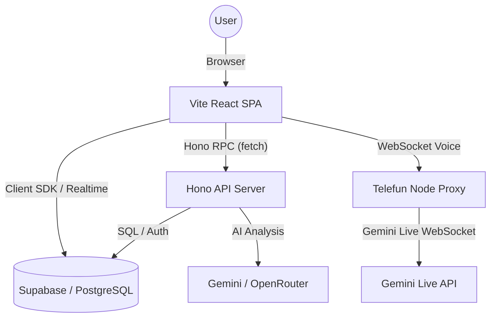

# System Architecture

Dokumen ini menjelaskan arsitektur teknis, tumpukan teknologi, dan struktur direktori proyek Trainers SuperApp (Monorepo Rebuild).

## Tech Stack

Aplikasi ini dibangun menggunakan arsitektur monorepo modern dengan pemisahan frontend dan backend yang jelas:

- **Monorepo Tool**: [Turborepo](https://turbo.build/) + [pnpm](https://pnpm.io/)
- **Frontend**: [Vite](https://vitejs.dev/) + [React 19](https://react.dev/) + [TanStack Router v1](https://tanstack.com/router)
- **Backend**: [Hono](https://hono.dev/) (Node.js API server)
- **Bahasa**: [TypeScript](https://www.typescriptlang.org/)
- **Styling**: [Tailwind CSS 4](https://tailwindcss.com/)
- **Backend as a Service**: [Supabase](https://supabase.com/) (Auth, PostgreSQL, RLS, Storage)
- **Animasi**: [Framer Motion / Motion](https://www.framer.com/motion/)
- **Visualisasi Data**: [Recharts](https://recharts.org/)
- **Ikon**: [Lucide React](https://lucide.dev/)
- **API Type Safety**: Hono RPC (`hc<AppType>`) untuk full type-safety antara frontend dan backend
- **Validasi**: [Zod](https://zod.dev/) (shared schemas di `packages/types`)

## High-Level Architecture



### Penjelasan Alur:

1. **Frontend (`apps/web`)**: Vite + React SPA dengan TanStack Router. Semua route di-lazy load via `React.lazy()`.
2. **Backend (`apps/api`)**: Hono API server dengan route handlers di `src/routes/`. Business logic di `src/services/`.
3. **Hono RPC**: Frontend mengonsumsi API via `hc<AppType>` dari Hono RPC — full type-safety tanpa perlu definisi API terpisah.
4. **Supabase**: Menangani autentikasi user, penyimpanan data persisten, RLS, dan media Storage.
5. **RLS (Row Level Security)**: Memastikan keamanan data di tingkat database berdasarkan role user (Admin, Trainer, Leader, Agent).
6. **Telefun Proxy (`apps/telefun`)**: Service Node terpisah untuk memvalidasi token Supabase lalu meneruskan audio ke Gemini Live API.
7. **AI Providers**: Modul simulasi dan laporan memakai provider abstraction server-side di backend (Hono) yang saat ini mendukung Gemini dan OpenRouter. Semua AI calls dicatat ke `ai_usage_logs`.
8. **Shared Types (`packages/types`)**: Zod schemas dan TypeScript interfaces yang dipakai bersama oleh frontend dan backend.

## Directory Structure

Struktur folder monorepo:

```text
├── apps/
│   ├── web/                    # Frontend Vite + React + TanStack Router
│   │   ├── src/
│   │   │   ├── routes/         # Page components per module (37 routes, all React.lazy())
│   │   │   ├── components/     # Shared UI components (Layout, Sidebar, dll)
│   │   │   ├── hooks/          # Custom React hooks
│   │   │   ├── lib/            # Utilities, API client (Hono RPC), config
│   │   │   └── router.tsx      # Centralized TanStack Router v1 route definitions
│   │   ├── index.html          # Entry point dengan resource hints
│   │   └── vite.config.ts      # Vite config dengan code splitting
│   ├── api/                    # Backend Hono API server
│   │   ├── src/
│   │   │   ├── routes/         # Hono route handlers (sidak, ketik, pdkt, ai, profiler, admin)
│   │   │   ├── services/       # Business logic (sidak-service, ketik-service, dll)
│   │   │   ├── lib/            # AI models, scoring, usage logging, Supabase clients
│   │   │   └── index.ts        # Hono app entry point + AppType export
│   │   └── vitest.config.ts    # API test config
│   └── telefun/                # WebSocket proxy server untuk Gemini Live
│       └── src/                # Server, auth, usage, env handling
├── packages/
│   └── types/                  # Shared Zod schemas & TypeScript interfaces
│       └── src/index.ts        # Semua shared types (Profiler, Admin, SIDAK, dll)
├── reference-repo/             # Sumber referensi logic dari codebase lama (Next.js)
│   ├── app/                    # Next.js App Router (referensi saja)
│   └── docs/                   # Dokumentasi legacy (referensi)
├── supabase/
│   └── migrations/             # DB schemas (000 profiles, 001 SIDAK, 002 KETIK/PDKT/AI, 003 Telefun, 004 Admin, 005 carbon copy, 006 user settings, 007 report archives, 008 profile admin policies, 009 storage RLS, 010 activity_logs index)
├── docs/                       # Dokumentasi teknis sistem
│   ├── rebuild-logs/           # Per-phase completion logs (phase-1 through phase-18)
│   └── superpowers/            # Plans dan specs dari superpowers skills
├── opencode.json               # Project-level opencode config dengan context7 MCP
├── AGENTS.md                   # Panduan development untuk AI agents
└── package.json                # Root package.json (pnpm workspace + Turborepo)
```

## Data Flow Pattern

Proyek ini mengutamakan pola **Centralized Service Layer** di backend:

- Logic database tidak diletakkan langsung di dalam komponen UI frontend.
- Semua query kompleks berada di `apps/api/src/services/` (contoh: `sidak-service.ts`, `profiler-service.ts`).
- Mutasi data dilakukan melalui Hono route handlers di `apps/api/src/routes/`.
- Frontend mengonsumsi API via Hono RPC client (`hc<AppType>`) untuk full type-safety.
- Hybrid Client Pattern untuk Supabase:
  - Default: Gunakan User JWT untuk menghormati RLS.
  - Admin Client (Service Role): Hanya di backend untuk AI logging, background jobs, dan heavy reports.
- Monitoring lintas akun dan usage billing menggunakan server-side access via admin client, bukan direct browser read terhadap tabel sensitif.
- History simulasi KETIK/PDKT menggunakan tabel modul masing-masing sebagai sumber utama.
- Module settings (KETIK, PDKT, Telefun) disimpan namespaced di `user_settings.settings.<module>` agar tidak saling timpa. Setiap modul wajib membaca existing settings sebelum menulis.
- **SIDAK Dashboard Performance**: Materialized view (`mv_qa_period_summary`) menyediakan ringkasan KPI dengan fallback chain: MV → `qa_dashboard_period_summary` cache → raw computed values. MV direfresh async via `refreshMaterializedView()` setelah `createTemuanBatch()`.
- **Soft-delete Exclusion**: Semua query SIDAK (dashboard, agents, data reports) otomatis mengecualikan peserta yang terhubung ke profile soft-deleted/inactive, dengan opsi `show_archived=true` untuk override.

## AI Integration Pattern

- Integrasi AI dipusatkan di backend service wrapper (`apps/api/src/lib/gemini.ts`, `apps/api/src/lib/openrouter.ts`).
- Pemilihan model dan provider mengikuti canonical mapping di `apps/api/src/lib/ai-models.ts`.
- Semua AI calls wajib dicatat (logged) dari backend ke tabel `ai_usage_logs` via `logAiUsage()`.
- `logAiUsage()` sekarang menerima parameter `status` (`'success'` | `'failed'` | `'timeout'`) dan `errorMessage`. Jika gagal/timeout, token di-set ke 0 dan error message dicatat.
- `resolveModelProvider()` mendeteksi Gemini (tanpa `/`) vs OpenRouter (dengan `/`).
- OpenRouter punya 4-attempt retry dengan backoff untuk 429.
- Caller modul tidak boleh mengasumsikan bentuk response SDK/provider selalu stabil; ekstraksi `text` harus defensif.
- Usage AI dicatat server-side setelah request final (sukses maupun gagal). Setiap `request_id` unik — retry/fallback internal tidak menghasilkan row tambahan. Response tanpa metadata token tidak boleh menghasilkan usage log palsu.

## Environment & Runtime

### Frontend (`apps/web`) — prefix `VITE_`:

- `VITE_SUPABASE_URL`
- `VITE_SUPABASE_ANON_KEY`
- `VITE_TELEFUN_WS_URL`

### Backend (`apps/api`) — variabel langsung:

- `SUPABASE_URL`
- `SUPABASE_SERVICE_ROLE_KEY`
- `GEMINI_API_KEY`
- `OPENROUTER_API_KEY`

### Telefun Server (`apps/telefun`) — variabel langsung:

- `SUPABASE_URL`
- `SUPABASE_ANON_KEY`
- `SUPABASE_SERVICE_ROLE_KEY`
- `GEMINI_API_KEY`

### MCP / Tools:

- `CONTEXT7_API_KEY` — disimpan di `.env.local` untuk context7 MCP server.

File `.env.local` di root diabaikan oleh git, tapi isinya harus disinkronkan ke masing-masing apps jika diperlukan.

## Commands & Verification

```bash
# Install dependencies
pnpm install

# Development (menjalankan web, api, dan telefun secara paralel)
pnpm dev

# Build production
pnpm build

# Lint seluruh workspace
pnpm lint

# Test seluruh workspace (108 API + 61 web = 169 tests)
pnpm test

# Test API only
pnpm --filter @trainers/api test

# Test Web only
pnpm --filter @trainers/web test

# Format code
pnpm format

# Telefun standalone
pnpm --filter @trainers/telefun dev
```

Catatan:

- Build tidak menerapkan migration Supabase. SQL di `supabase/migrations/` tetap harus dipush atau dieksekusi ke target Supabase.
- Artifact backup berada di `local-backups/` dan tidak boleh masuk git.

## Security Model

Keamanan aplikasi dijaga di beberapa sisi:

1. **Frontend Route Guards**: TanStack Router dengan lazy loading dan auth checks di komponen Layout.
2. **Backend Middleware**: Hono middleware chain — `authMiddleware` (JWT validation, global via app.ts) + `requireRole()` (per-route) applied to 48+ endpoints across Profiler, PDKT, AI monitoring, KETIK, SIDAK, and Admin. Duplicate authMiddleware removed from all 7 sub-routers.
3. **Database RLS**: Filter data di tingkat PostgreSQL sehingga user hanya bisa melihat/mengubah data sesuai hak akses mereka. Semua 32 tabel RLS-enabled. Policy gaps closed: write_trainer for dashboard summary tables, admin profiles policies (migration 008).
4. **Admin Server Boundary**: Service role hanya dipakai di backend (Hono) untuk operasi yang membutuhkan akses lintas akun.
5. **Hono RPC Type Safety**: `hc<AppType>` memastikan frontend tidak bisa mengirim payload yang tidak sesuai dengan validasi Zod di backend.

## Performance Guardrails (FCP/LCP)

- Code splitting & lazy loading sudah diterapkan — semua 37 route di `router.tsx` menggunakan `React.lazy()`.
- Library berat (Recharts >300 kB, ExcelJS/xlsx >400 kB) di-import secara dinamis di komponen yang membutuhkan.
- Resource hints (`modulepreload`, `preconnect`, `dns-prefetch`) ditambahkan di `index.html`.
- Chunk >200 kB yang bukan vendor stabil dipertimbangkan untuk split lanjutan via `manualChunks`.
- Jangan tambah library baru tanpa cek bundle impact-nya.
