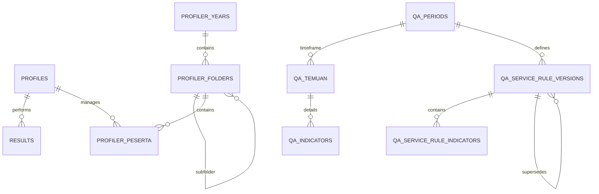

# Database Schema & Security

Dokumen ini menjelaskan struktur tabel PostgreSQL di Supabase dan kebijakan Row Level Security (RLS) yang diterapkan, serta model hak akses eksplisit (Explicit Data API Grants) untuk keamanan maksimal.

---

## 🌟 Pengantar untuk Pengguna Umum (Human-Readable Overview)

### Apa itu Struktur Database dan Keamanan Ini?

Database Supabase bertindak sebagai brankas utama tempat seluruh data aplikasi Trainers SuperApp disimpan—mulai dari informasi akun pengguna, hasil simulasi pelatihan, hingga temuan audit kualitas.

Sistem keamanan database kami dirancang dengan prinsip **"Tolak Akses Sejak Awal" (Deny-by-Default)**. Artinya, secara bawaan, tidak ada satu pun orang atau program luar yang diizinkan mengintip atau mengubah isi tabel apa pun, kecuali mereka memiliki kunci atau izin khusus yang secara eksplisit diberikan oleh sistem.

### Manfaat Langsung bagi Pengguna:

1. **Privasi Data Terjamin:** Data pribadi, nilai simulasi, dan rekaman suara Anda sepenuhnya terisolasi. Pengguna lain tidak akan bisa melihat data Anda tanpa otorisasi yang sah.
2. **Perlindungan dari Pihak Luar:** Pihak yang tidak masuk log (_unauthenticated/anon_) tidak memiliki celah untuk menebak-nebak daftar email pengguna atau mengakses fitur apa pun di latar belakang.
3. **Keteraturan Kerja:** Setiap peran (Agent, Leader, dan Trainer) memiliki jalur atau pintu khusus. Hal ini mencegah kekeliruan, seperti Agent tanpa sengaja mengubah pengaturan harga atau menghapus rekaman orang lain.

---

## ER Diagram (Overview)

## Tabel Utama

**Catatan Migration Baseline:** Schema aplikasi dikelola di `supabase/migrations/` (14 files, fully idempotent):

- `000_profiles_core.sql` — Profiles & auth tables
- `001_sidak_core.sql` — SIDAK core + Profiler tables (12 tables, all RLS-enabled)
- `002_ketik_pdkt_core.sql` — KETIK, PDKT, AI usage tables
- `003_telefun_core.sql` — Telefun tables
- `004_admin_core.sql` — Admin management tables
- `005_carbon_copy_parity.sql` — KETIK/PDKT carbon copy parity features
- `006_create_user_settings.sql` — User settings table
- `007_report_archives.sql` — Report archives for persistence
- `008_profile_admin_policies.sql` — Admin/trainer SELECT+UPDATE on profiles
- `009_storage_rls_policies.sql` — Storage bucket RLS policies
- `010_activity_logs_index.sql` — Index `activity_logs.created_at`
- `011_materialized_view_dashboard.sql` — Materialized view `mv_qa_period_summary`
- `012_ai_usage_status_error.sql` — AI usage status/error columns
- `013_refresh_mv_function.sql` — RPC `refresh_mv_qa_period_summary()`
- `20260525000100_sidak_dashboard_summary_vite_schema_refresh.sql` — Target-schema-compatible `refresh_qa_dashboard_summary_for_period`
- `20260525000200_restore_mv_qa_period_summary_contract.sql` — Idempotent MV + refresh function contract repair
- `20260525000300_telefun_history_add_consumer_contact_columns.sql` — Add consumer_phone and consumer_city columns to telefun_history
- `20260525000400_telefun_history_add_feedback.sql` — Add feedback column to telefun_history for API patch compatibility

### 1. `public.profiles`

Menyimpan data profil user yang terintegrasi dengan `auth.users`.

- `id` (UUID, Primary Key): ID user dari Supabase Auth.
- `email` (Text, Unique): Email user.
- `full_name` (Text): Nama lengkap user.
- `role` (Text): Role user (`admin`, `trainer`, `leader`, `agent`).
- `status` (Text): Status akun (`pending`, `approved`, `rejected`).
- `created_at` (Timestamptz): Timestamp pendaftaran akun.
- `is_deleted` (Boolean): Flag untuk soft delete akun.

### 2. `public.results`

Menyimpan hasil simulasi legacy/kompatibilitas dari modul Ketik dan Telefun.

- `id` (UUID, Primary Key): ID unik hasil simulasi.
- `user_id` (UUID): Referensi ke `auth.users(id)`.
- `module` (Text): Nama modul.
- `score` (NUMERIC): Skor hasil simulasi.
- `details` (JSONB): Detail hasil, metadata.
- `created_at`, `updated_at` (Timestamptz): Timestamp.

### 3. Modul Simulasi

- **`ketik_history`**: Riwayat sesi KETIK per user, termasuk skenario, identitas konsumen, dan messages.
- **`ketik_session_reviews`**: Hasil review AI per sesi KETIK. Berisi skor, rubrik, dan feedback dalam format JSONB.
- **`pdkt_history`**: Riwayat sesi PDKT per user, email thread, config, dan hasil evaluasi async.
- **`pdkt_mailbox_items`**: Kotak masuk simulasi PDKT yang persisten. Menyimpan inbound email, status (`open`, `replied`, `deleted`).
- **`telefun_history`**: Riwayat sesi TELEFUN per user, termasuk skenario, durasi, URL rekaman, skor, dan feedback.
- **`telefun_replay_annotations`**: Anotasi AI dan manual untuk fitur Replay Telefun.
- **`user_settings`**: Settings modul yang disimpan per user untuk KETIK, PDKT, dan TELEFUN.

### 4. Modul Profiler (KTP)

- **`profiler_years`**: Daftar tahun database.
- **`profiler_folders`**: Batch atau grup peserta (mendukung struktur folder bertingkat).
- **`profiler_peserta`**: Data detail peserta (NIK, Alamat, Foto, dll).
- **`profiler_tim_list`**: Daftar tim operasional yang tersedia.

### 5. Modul SIDAK (QA Analyzer)

- **`mv_qa_period_summary`**: Materialized view untuk ringkasan KPI dashboard per periode. Dibuat via `011_materialized_view_dashboard.sql` dan dijamin kontraknya via `20260525000200_restore_mv_qa_period_summary_contract.sql`. Direfresh via `refresh_mv_qa_period_summary()`.
- **`qa_dashboard_period_summary`**: Summary KPI per periode per service per folder untuk dashboard SIDAK (Vite cache, menggunakan `folder_id` bukan `folder_key`). Dihasilkan oleh `refresh_qa_dashboard_summary_for_period()`.
- **`qa_dashboard_agent_period_summary`**: Skor dan metrik per agent per periode per service (Vite cache, menggunakan `agent_id`). Dihasilkan oleh `refresh_qa_dashboard_summary_for_period()`.
- **`qa_periods`**: Definisi periode audit kualitas.
- **`qa_temuan`**: Data utama audit (Agent, Tim, Temuan, Status).
- **`qa_indicators`**: Daftar parameter penilaian audit.
- **`qa_service_weights`**: Bobot default per service type.
- **`qa_service_rule_versions`**: Versi rule per service+periode dengan status `draft`, `published`, atau `superseded`.
- **`qa_service_rule_indicators`**: Snapshot indikator per rule version.

**Dashboard Summary Refresh**: Fungsi `refresh_qa_dashboard_summary_for_period(p_period_id, p_folder_key)` didesain ulang agar kompatibel dengan Vite schema — menggunakan `folder_id` dan `agent_id` pada cache tables. Fungsi ini juga diinvoke oleh `scripts/database-parity/sidak-post-sync-verify.mjs --refresh-summaries` untuk backfill summary seluruh periode.

**Soft-delete Exclusion**: Queries dashboard SIDAK (`getDashboardData`, `getAgents`, `getDataReportRows`) secara otomatis mengecualikan peserta yang terhubung ke profile soft-deleted (`is_deleted=true`) atau inactive (`status=inactive`), kecuali `show_archived=true` dikirim sebagai query param.

### 6. Admin & Access Control

- **`access_groups`**: Definisi access group (nama, deskripsi, scope_type, is_active).
- **`access_group_items`**: Item scope individual (field_name: `peserta_id`, `batch_name`, `tim`, `service_type`).
- **`leader_access_requests`**: Request approval per leader per module.
- **`leader_access_request_groups`**: Join table: satu approved request bisa memiliki >1 access group.

### 7. Monitoring AI Usage & Billing

- **`mv_qa_period_summary`**: Materialized view untuk ringkasan KPI dashboard SIDAK per periode. Diprioritaskan dari pada `qa_dashboard_period_summary` dengan fallback chain: MV → cache → computed.
- **`ai_usage_logs`**: Log 1 baris per AI call (sukses maupun gagal/timeout). Menyimpan `request_id`, `user_id`, `provider`, `model_id`, `module`, `action`, token, harga, kurs, estimasi biaya, `status` (success/failed/timeout), dan `error_message`.
- **`ai_pricing_settings`**: Harga token input/output per model kanonik.
- **`ai_billing_settings`**: Riwayat nilai kurs global USD ke IDR.

## Keamanan Data (Explicit Grants & RLS Policies)

Sistem otorisasi data kami menggabungkan dua lapisan pertahanan utama: **Explicit Data API Grants** pada tingkat tabel/fungsi dan **Row Level Security (RLS)** pada tingkat baris.

### 🔒 Lapisan 1: Hak Akses Eksplisit (Explicit Data API Grants)

Berdasarkan mitigasi keamanan terbaru, seluruh hak akses bawaan yang luas (`GRANT ALL ON ... TO anon, public`) telah **dicabut secara permanen**.

- **Peran `anon` dan `public`:** Tidak memiliki akses `SELECT`, `INSERT`, `UPDATE`, atau `DELETE` pada tabel aplikasi apa pun.
- **Peran `authenticated`:** Diberikan hak akses secara terperinci (granular) hanya pada tabel-tabel yang berinteraksi dengan pengguna aktif. Tabel internal tingkat sistem seperti `ai_usage_logs`, `ai_pricing_settings`, dan `ai_billing_settings` sepenuhnya **tertutup** dari akses client (_zero client-side grants_) dan hanya dapat dimanipulasi melalui klien admin di sisi backend (Hono API).
- **Remote Procedure Calls (RPC):** Hak eksekusi (`EXECUTE`) fungsi dibatasi secara ketat ke peran `authenticated` atau `service_role`.

### 🛡️ Lapisan 2: Row Level Security (RLS)

Setelah pengguna lolos dari lapisan hak akses tabel, RLS memastikan mereka hanya dapat melihat atau memodifikasi baris data yang menjadi haknya. RLS diaktifkan di seluruh tabel tanpa terkecuali.

| Tabel                                  | Role: Agent                                               | Role: Leader                                       | Role: Trainer/Admin                    |
| -------------------------------------- | --------------------------------------------------------- | -------------------------------------------------- | -------------------------------------- |
| `profiles`                             | Insert (Own Pending), Update (full_name only), Read (Own) | Read (All), Update (full_name only)                | Mutasi via Admin Client (service role) |
| `results`                              | Read/Write (Own)                                          | Read (Team)                                        | Read/Update (All)                      |
| `profiler_years`                       | No Access                                                 | Read (Approved KTP scope only)                     | Full CRUD Access                       |
| `profiler_folders`                     | No Access                                                 | Read (Scoped via `batch_name`)                     | Full CRUD Access                       |
| `profiler_tim_list`                    | No Access                                                 | Read (Scoped via `tim`)                            | Full CRUD Access                       |
| `profiler_peserta`                     | No Access                                                 | Read (Scoped via `leader_can_access_peserta`)      | Full CRUD Access                       |
| `qa_periods`                           | Read (All)                                                | Read (All)                                         | Full CRUD Access                       |
| `qa_indicators`                        | Read (All)                                                | Read (All)                                         | Full CRUD Access                       |
| `qa_temuan`                            | Read (Own via email_ojk match)                            | Read (Scoped via `leader_can_access_sidak_temuan`) | Full CRUD Access                       |
| `ketik_history`                        | Read/Write/Delete (Own)                                   | No Access                                          | No Access                              |
| `pdkt_history`                         | Read/Write/Delete (Own)                                   | No Access                                          | No Access                              |
| `user_settings`                        | Full CRUD (Own)                                           | Full CRUD (Own)                                    | Full CRUD (Own)                        |
| `ketik_session_reviews`                | Read (Own)                                                | No Access                                          | Read/Delete (Trainer/Admin)            |
| `pdkt_mailbox_items`                   | Read/Update (Own)                                         | Read (Scoped)                                      | Read/Delete (Trainer/Admin)            |
| `telefun_replay_annotations`           | Read/Insert (Own)                                         | No Access                                          | Read/Insert (via server action)        |
| `access_groups` / `access_group_items` | No Access                                                 | No Access                                          | Full CRUD (Admin/Trainer)              |
| `leader_access_requests`               | No Access                                                 | Read/Insert (Own)                                  | Full CRUD (Admin/Trainer)              |
| `qa_dashboard_period_summary`          | Read (All)                                                | Read (All)                                         | Full CRUD (Admin/Trainer)              |
| `qa_dashboard_agent_period_summary`    | Read (All)                                                | Read (All)                                         | Full CRUD (Admin/Trainer)              |

**Catatan Proteksi `profiles`:**

- Self-insert dibatasi ke profil sendiri dengan `status = 'pending'` dan `role != 'admin'`.
- Self-update dibatasi ke kolom `full_name`.
- Mutasi manajerial (change status/role/soft-delete) memakai admin client di backend yang bypass RLS via service role, setelah validasi caller.
- **SELECT membutuhkan RLS policies** — table grant `SELECT` saja tidak cukup. Policies wajib: own-profile, admin-all, trainer-all, leader-all.
- Migration `008_profile_admin_policies.sql` menambahkan `profiles_select_admin` dan `profiles_update_admin` untuk defense-in-depth via user JWT (sebelumnya hanya via service_role).

**Catatan Monitoring AI Usage:**

- `leader` hanya mendapatkan visibilitas usage monitoring dari backend API yang sudah di-gate role.
- Editor pricing dan kurs hanya tersedia untuk `trainer` dan `admin`.
- Akses aplikasi untuk permukaan monitoring dijelaskan lebih detail di `docs/auth-rbac.md` dan `docs/MONITORING_TOKEN_USAGE_BILLING.md`.

## Storage

Aplikasi menggunakan Supabase Storage bucket:

- `profiler-foto`: Menyimpan foto aset peserta (KTP/Profiler). Bucket ini public untuk read, write dibatasi ke role `trainer` dan `admin`.
- `reports`: Menyimpan dokumen laporan AI SIDAK yang di-generate (`.docx` dan `.html`).
- `telefun-recordings`: Menyimpan rekaman Telefun jika fitur rekaman digunakan.

Backup database via `pg_dump` hanya mencakup schema/data PostgreSQL dan metadata storage. File fisik di bucket Storage harus dibackup terpisah; lihat `docs/SUPABASE_LOCAL_BACKUP.md`.
