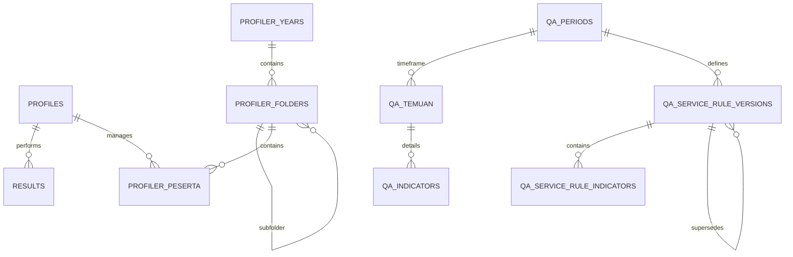

# Database Schema & Security

Dokumen ini menjelaskan struktur tabel PostgreSQL di Supabase dan kebijakan Row Level Security (RLS) yang diterapkan, serta model hak akses eksplisit (Explicit Data API Grants) untuk keamanan maksimal.

---

## 🌟 Pengantar untuk Pengguna Umum (Human-Readable Overview)

### Apa itu Struktur Database dan Keamanan Ini?

Database Supabase bertindak sebagai brankas utama tempat seluruh data aplikasi Trainers SuperApp disimpan—mulai dari informasi akun pengguna, hasil simulasi pelatihan, hingga temuan audit kualitas.

Sistem keamanan database kami dirancang dengan prinsip **"Tolak Akses Sejak Awal" (Deny-by-Default)**. Artinya, secara bawaan, tidak ada satu pun orang atau program luar yang diizinkan mengintip atau mengubah isi tabel apa pun, kecuali mereka memiliki kunci atau izin khusus yang secara eksplisit diberikan oleh sistem.

### Manfaat Langsung bagi Pengguna:

1. **Privasi Data Terjamin:** Data pribadi, nilai simulasi, dan rekaman suara Anda sepenuhnya terisolasi. Pengguna lain tidak akan bisa melihat data Anda tanpa otorisasi yang sah.
2. **Perlindungan dari Pihak Luar:** Pihak yang tidak masuk log (_unauthenticated/anon_) tidak memiliki celah untuk menebak-nebak daftar email pengguna atau mengakses fitur apa pun di latar belakang.
3. **Keteraturan Kerja:** Setiap peran (Agent, Leader, dan Trainer) memiliki jalur atau pintu khusus. Hal ini mencegah kekeliruan, seperti Agent tanpa sengaja mengubah pengaturan harga atau menghapus rekaman orang lain.

---

## ER Diagram (Overview)

## Tabel Utama

**Catatan Migration Baseline:** Schema aplikasi dikelola di `supabase/migrations/`. Migration Phase 4 di bawah adalah artifact repository yang additive dan transactional; keberadaannya di tree tidak berarti sudah diterapkan ke database remote.

**Core Migrations (000–017):**

- `000_profiles_core.sql` — Profiles & auth tables
- `001_sidak_core.sql` — SIDAK core + Profiler tables (12 tables, all RLS-enabled)
- `002_ketik_pdkt_core.sql` — KETIK, PDKT, AI usage tables
- `003_telefun_core.sql` — Telefun tables
- `004_admin_core.sql` — Admin management tables
- `005_carbon_copy_parity.sql` — KETIK/PDKT carbon copy parity features
- `006_create_user_settings.sql` — User settings table
- `007_report_archives.sql` — Report archives for persistence
- `008_profile_admin_policies.sql` — Admin/trainer SELECT+UPDATE on profiles
- `009_storage_rls_policies.sql` — Storage bucket RLS policies
- `010_activity_logs_index.sql` — Index `activity_logs.created_at`
- `011_materialized_view_dashboard.sql` — Materialized view `mv_qa_period_summary`
- `012_ai_usage_status_error.sql` — AI usage status/error columns
- `013_refresh_mv_function.sql` — RPC `refresh_mv_qa_period_summary()`
- `014_storage_buckets.sql` — Storage bucket policies
- `015_tighten_sidak_rls.sql` — SIDAK RLS tightening
- `016_harden_profiles_rls.sql` — Profiles RLS hardening
- `017_harden_mv_qa_period_summary.sql` — MV hardening (revokes from non-service_role)

**Timestamp Migrations (20260520–20260801):**

| Migration                                                                 | Purpose                                                                                                                      |
| ------------------------------------------------------------------------- | ---------------------------------------------------------------------------------------------------------------------------- |
| `20260520054101_add_is_deleted_to_profiles.sql`                           | Add `is_deleted` column to profiles                                                                                          |
| `20260522093000_profiler_unique_constraints.sql`                          | Profiler unique constraints                                                                                                  |
| `20260523000000_telefun_parity_extensions.sql`                            | Telefun parity extensions                                                                                                    |
| `20260525000100_sidak_dashboard_summary_vite_schema_refresh.sql`          | Target-schema-compatible `refresh_qa_dashboard_summary_for_period`                                                           |
| `20260525000200_restore_mv_qa_period_summary_contract.sql`                | Idempotent MV + refresh function contract repair                                                                             |
| `20260525000300_telefun_history_add_consumer_contact_columns.sql`         | Add consumer_phone and consumer_city to telefun_history                                                                      |
| `20260525000400_telefun_history_add_feedback.sql`                         | Add feedback column to telefun_history                                                                                       |
| `20260525000500_telefun_history_add_metadata_columns.sql`                 | Add metadata columns to telefun_history                                                                                      |
| `20260526090000_reharden_mv_qa_period_summary_after_contract_restore.sql` | Terminal re-hardening: revoke all non-service_role access                                                                    |
| `20260527000000_add_unique_index_qa_temuan_duplicate_input.sql`           | Unique index on qa_temuan for duplicate prevention                                                                           |
| `20260527000001_add_simulation_duration_to_ketik_history.sql`             | Add `simulation_duration` to ketik_history                                                                                   |
| `20260527000002_add_unique_index_ketik_review_jobs_session_id.sql`        | Unique index on ketik_review_jobs                                                                                            |
| `20260602000000_fix_bulk_reorder_profiler_peserta_auth.sql`               | Fix profiler reorder authorization                                                                                           |
| `20260603090000_pdkt_shared_mailbox_policy.sql`                           | PDKT shared mailbox RLS + soft-delete RPC                                                                                    |
| `20260603100000_pdkt_fix_soft_delete_rpc.sql`                             | Fix soft_delete_pdkt_mailbox_item RPC                                                                                        |
| `20260604100000_restore_profiler_foto_bucket.sql`                         | Restore profiler-foto storage bucket                                                                                         |
| `20260605100000_atomic_monitoring_history_delete.sql`                     | Atomic monitoring history delete RPC                                                                                         |
| `20260611100000_fix_telefun_coaching_summary_rpc_contract.sql`            | Fix telefun coaching summary RPC                                                                                             |
| `20260611200000_telefun_scoring_lifecycle.sql`                            | Telefun scoring lifecycle contract                                                                                           |
| `20260611201000_telefun_scoring_retry_queue.sql`                          | Telefun scoring retry queue                                                                                                  |
| `20260612000000_fix_profiles_rls_recursion.sql`                           | Fix profiles RLS recursion                                                                                                   |
| `20260614090000_sidak_dashboard_forecast_snapshots.sql`                   | SIDAK dashboard forecast snapshots table                                                                                     |
| `20260618100000_add_get_profiler_folder_counts_rpc.sql`                   | RPC `get_profiler_folder_counts(uuid[])`                                                                                     |
| `20260618101000_add_access_groups_count_view.sql`                         | View `v_access_groups_with_item_counts`                                                                                      |
| `20260618102000_add_get_leader_scope_snapshot_rpc.sql`                    | RPC `get_leader_scope_snapshot(uuid, text)`                                                                                  |
| `20260618110000_add_mimo_model_pricing.sql`                               | Add MiMo model pricing                                                                                                       |
| `20260618200000_fix_billing_singleton_upsert.sql`                         | Fix billing singleton upsert                                                                                                 |
| `20260618210000_ai_usage_modality_tokens.sql`                             | AI usage modality token columns                                                                                              |
| `20260618220000_ai_usage_reconciliation_view.sql`                         | AI usage reconciliation view                                                                                                 |
| `20260619090000_telefun_live_per_minute_billing.sql`                      | Telefun live per-minute billing columns                                                                                      |
| `20260622150000_repair_telefun_scoring_lifecycle_contract.sql`            | Repair telefun scoring lifecycle contract                                                                                    |
| `20260630003553_add_current_sidak_profiler_lookup_indexes.sql`            | SIDAK profiler lookup indexes                                                                                                |
| `20260801120000_telefun_openai_webrtc_phase4_durable_lifecycle.sql`       | Additive Telefun WebRTC attempt/transcript/usage/finalization, recording readiness, scoring lock, and service-role RPCs      |
| `20260801142542_telefun_openai_webrtc_phase5_production_hardening.sql`    | Distributed WebRTC lease/quota, rate-limit windows, orphan cleanup, hashed-user metrics, and precise network/orphan outcomes |

### 1. `public.profiles`

Menyimpan data profil user yang terintegrasi dengan `auth.users`.

- `id` (UUID, Primary Key): ID user dari Supabase Auth.
- `email` (Text, Unique): Email user.
- `full_name` (Text): Nama lengkap user.
- `role` (Text): Role user (`admin`, `trainer`, `leader`, `agent`).
- `status` (Text): Status akun (`pending`, `approved`, `rejected`).
- `created_at` (Timestamptz): Timestamp pendaftaran akun.
- `is_deleted` (Boolean): Flag untuk soft delete akun.

### 2. `public.results`

Menyimpan hasil simulasi legacy/kompatibilitas dari modul Ketik dan Telefun.

- `id` (UUID, Primary Key): ID unik hasil simulasi.
- `user_id` (UUID): Referensi ke `auth.users(id)`.
- `module` (Text): Nama modul.
- `score` (NUMERIC): Skor hasil simulasi.
- `details` (JSONB): Detail hasil, metadata.
- `created_at`, `updated_at` (Timestamptz): Timestamp.

### 3. Modul Simulasi

- **`ketik_history`**: Riwayat sesi KETIK per user, termasuk skenario, identitas konsumen, messages, dan `simulation_duration` (durasi simulasi dalam menit, nullable untuk backward compatibility).
- **`ketik_session_reviews`**: Hasil review AI per sesi KETIK. Berisi skor, rubrik, dan feedback dalam format JSONB.
- **`pdkt_history`**: Riwayat sesi PDKT per user, email thread, config, dan hasil evaluasi async.
- **`pdkt_mailbox_items`**: Kotak masuk simulasi PDKT yang persisten. Menyimpan inbound email, status (`open`, `replied`, `deleted`).
- **`telefun_history`**: Riwayat sesi TELEFUN per user, termasuk skenario, durasi, URL/path rekaman, skor, feedback, dan Phase 4 recording/scoring readiness state.
- **`telefun_replay_annotations`**: Anotasi AI dan manual untuk fitur Replay Telefun.
- **`user_settings`**: Settings modul yang disimpan per user untuk KETIK, PDKT, dan TELEFUN.

#### Phase 4 Telefun WebRTC durable schema (hosted contract and repository artifact)

Migration `20260801120000_telefun_openai_webrtc_phase4_durable_lifecycle.sql` menambahkan kontrak additive berikut:

- `telefun_history.recording_status`, `recording_ready_at`, `recording_error`, dan `scoring_ready_at`. Capture failure diberi error bounded; WebRTC readiness hanya membuka scoring setelah session terminal dan path agent seekable yang exact.
- `telefun_realtime_attempts`: satu attempt per session melalui `UNIQUE(session_id)`, finalization key dan usage request ID unik, state `claimed/brokered/sideband_connected/ending/ended`, hashed provider reference, usage status, dan transcript checkpoint sequence.
- `telefun_realtime_transcript_events`: checkpoint transcript per attempt dengan `UNIQUE(attempt_id, dedupe_key)` dan `UNIQUE(attempt_id, sequence)`, speaker/text/start-time bounded, serta partial-update semantics.
- Trigger/function mencegah penghapusan history atau attempt WebRTC yang masih aktif. Attempt dan transcript tables mengaktifkan RLS, mencabut akses `public`, `anon`, dan `authenticated`, lalu hanya memberi grant ke `service_role`.
- RPC server-only meliputi claim/bind/sideband/checkpoint/finalization/usage, `mark_telefun_recording_uploaded`, `mark_telefun_recording_ready`, `complete_telefun_scoring`, `claim_telefun_scoring`, dan `enqueue_telefun_scoring`. Migration mengirim `NOTIFY pgrst, 'reload schema'` di dalam transaction.
- `complete_telefun_scoring(UUID, NUMERIC, JSONB DEFAULT NULL) RETURNS BOOLEAN` mengambil row lock `FOR UPDATE`. Branch WebRTC memerlukan status `completed`, recording state non-failed, `scoring_ready_at`, dan exact `<user>/<session>/agent_only.seekable.webm`; branch Gemini/legacy OpenAI WebSocket mempertahankan gate lama. Capture failure yang beradu dengan scoring `processing` mengubah scoring WebRTC menjadi `failed`, sehingga completion stale mengembalikan `false`.

Rollback artifact `supabase/rollbacks/rollback_20260801120000_telefun_openai_webrtc_phase4_durable_lifecycle.sql` memulihkan body/signature/grant pre-Phase-4 untuk completion/claim/enqueue sebelum menghapus function/trigger/table dan empat kolom Phase 4. Rollback juga transactional dan mengirim schema reload notification. Hosted production inspection pada 2026-08-10 membuktikan migration Phase 4 dan service-role-only boundary terpasang. Standalone rollback Phase 4 tidak dijalankan; operasi tersebut khusus rollback/reapply Phase 5.

#### Phase 5 Telefun WebRTC distributed schema (hosted contract and repository artifact)

Migration `20260801142542_telefun_openai_webrtc_phase5_production_hardening.sql` menambahkan:

- `telefun_realtime_leases` dengan claim/renew/release atomic, advisory locks untuk cap user/provider, TTL, token hash, dan state cleanup orphan. Lease hilang memicu finalisasi `network_lost`; release bertoken tetap dicoba setelah provider ditutup agar row terminal tidak menunggu sweep.
- `telefun_realtime_rate_limits` dan RPC window atomic untuk scope user/session/provider. Semua RPC/table hanya untuk `service_role`; `public`, `anon`, dan `authenticated` dicabut dan RLS diaktifkan.
- Opaque provider call reference terenkripsi untuk cleanup restart, outcome `network_lost`/`orphaned`, counter duplicate/sideband/missing-usage, serta RPC claim/complete orphan yang mengembalikan cleanup gagal ke state retryable.
- `telefun_realtime_metrics` dengan nama metric allowlisted dan SHA-256 `user_id_hash`; UUID user mentah tidak disimpan di row metric. Missing/unpriceable usage tetap audit state dan tidak dibuat menjadi zero sintetis.

Rollback Phase 5 bersifat transactional dan fail-closed jika row outcome `network_lost`/`orphaned` belum didrain. Pada 2026-08-10, setelah explicit operator authorization dan private backup, stale OpenAI WebRTC lifecycle di database production canonical direkonsiliasi lalu canonical rollback/reapply dijalankan dalam satu transaction. Snapshot row lease/rate-limit/metric dan kolom attempt pulih identik; RLS serta 10 function grant tetap service-role-only; migration-history row tetap tepat satu; baseline history/usage Gemini sebelum/sesudah identik. Bukti ini menutup hosted database subgate, bukan deployment/load/paid-provider gate.

### 4. Modul Profiler (KTP)

- **`profiler_years`**: Daftar tahun database.
- **`profiler_folders`**: Batch atau grup peserta (mendukung struktur folder bertingkat).
- **`profiler_peserta`**: Data detail peserta (NIK, Alamat, Foto, dll).
- **`profiler_tim_list`**: Daftar tim operasional yang tersedia.

### 5. Modul SIDAK (QA Analyzer)

- **`mv_qa_period_summary`**: Materialized view untuk ringkasan KPI dashboard per periode. Dibuat via `011_materialized_view_dashboard.sql` dan dijamin kontraknya via `20260525000200_restore_mv_qa_period_summary_contract.sql`. Direfresh via `refresh_mv_qa_period_summary()`.
  - **Migration chain**: `011` (create MV) → `013` (create refresh function) → `017` (intermediate hardening, revokes from non-service_role) → `20260525000200` (contract restore, DROP CASCADE + recreate, regrants to authenticated+service_role) → `20260526090000` (terminal re-hardening, locks down to service_role only).
  - **Final security posture**: `SELECT` and `EXECUTE` on `mv_qa_period_summary` and `refresh_mv_qa_period_summary()` are granted exclusively to `service_role`. Zero client-side grants after the terminal migration.
- **`qa_dashboard_period_summary`**: Summary KPI per periode per service per folder untuk dashboard SIDAK (Vite cache, menggunakan `folder_id` bukan `folder_key`). Dihasilkan oleh `refresh_qa_dashboard_summary_for_period()`.
- **`qa_dashboard_agent_period_summary`**: Skor dan metrik per agent per periode per service (Vite cache, menggunakan `agent_id`). Dihasilkan oleh `refresh_qa_dashboard_summary_for_period()`.
  - **Peringatan**: Kolom skor (`final_score`, `non_critical_score`, `critical_score`) pada tabel ini bersifat **non-authoritative** untuk aplikasi read path. Migration refresh awal mengisi literal `0` sebagai placeholder, sehingga skor cache bisa tidak merepresentasikan nilai sebenarnya. Agent detail menghitung skor dari `qa_temuan` melalui scoring engine aplikasi (`PeriodScoringContext`), bukan dari tabel cache ini.
- **`qa_periods`**: Definisi periode audit kualitas.
- **`qa_temuan`**: Data utama audit (Agent, Tim, Temuan, Status).
- **`qa_indicators`**: Daftar parameter penilaian audit.
- **`qa_service_weights`**: Bobot default per service type.
- **`qa_service_rule_versions`**: Versi rule per service+periode dengan status `draft`, `published`, atau `superseded`.
- **`qa_service_rule_indicators`**: Snapshot indikator per rule version.

**Dashboard Summary Refresh**: Fungsi `refresh_qa_dashboard_summary_for_period(p_period_id, p_folder_key)` didesain ulang agar kompatibel dengan Vite schema — menggunakan `folder_id` dan `agent_id` pada cache tables. Fungsi ini juga diinvoke oleh `scripts/database-parity/sidak-post-sync-verify.mjs --refresh-summaries` untuk backfill summary seluruh periode.

**Soft-delete Exclusion**: Queries dashboard SIDAK (`getDashboardData`, `getAgents`, `getDataReportRows`) secara otomatis mengecualikan peserta yang terhubung ke profile soft-deleted (`is_deleted=true`) atau inactive (`status=inactive`), kecuali `show_archived=true` dikirim sebagai query param.

### 6. Admin & Access Control

- **`access_groups`**: Definisi access group (nama, deskripsi, scope_type, is_active).
- **`access_group_items`**: Item scope individual (field_name: `peserta_id`, `batch_name`, `tim`, `service_type`).
- **`leader_access_requests`**: Request approval per leader per module.
- **`leader_access_request_groups`**: Join table: satu approved request bisa memiliki >1 access group.

### 7. Monitoring AI Usage & Billing

- **`mv_qa_period_summary`**: Materialized view untuk ringkasan KPI dashboard SIDAK per periode. Dipelihara secara terpisah; endpoint dashboard utama menghitung ringkasan secara real-time dari data temuan mentah via scoring engine aplikasi.
- **`ai_usage_logs`**: Log 1 baris per AI call (sukses maupun gagal/timeout). Menyimpan `request_id`, `user_id`, `provider`, `model_id`, `module`, `action`, token, harga, kurs, estimasi biaya, `status` (success/failed/timeout), dan `error_message`.
- **`ai_pricing_settings`**: Harga token input/output per model kanonik.
- **`ai_billing_settings`**: Singleton table — tepat 1 baris (`key='default'`) menyimpan nilai kurs global USD ke IDR. Admin/trainer update via upsert, langsung berlaku untuk semua pengguna. Memiliki fallback legacy untuk kompatibilitas sebelum migrasi `20260618200000`.

#### Target schema: realtime modality dan cached usage

Bagian ini adalah **kontrak target additive** untuk task migration Telefun dual-provider; kolom target belum tersedia pada fase dokumentasi ini. Schema saat ini tetap memakai flat pricing `input_price_usd_per_million` / `output_price_usd_per_million`, ditambah snapshot modality non-cached yang sudah ada pada `ai_usage_logs`.

Target `ai_pricing_settings` menambah rate nullable/default-compatible berikut:

| Kelompok | Kolom target                                                                                                          |
| -------- | --------------------------------------------------------------------------------------------------------------------- |
| Text     | `input_text_price_usd_per_million`, `cached_input_text_price_usd_per_million`, `output_text_price_usd_per_million`    |
| Audio    | `input_audio_price_usd_per_million`, `cached_input_audio_price_usd_per_million`, `output_audio_price_usd_per_million` |

Target `ai_usage_logs` mempertahankan snapshot provider/model yang dinamis pada `provider` dan `model_id`, lalu menambah snapshot cached berikut untuk rekonsiliasi:

- `cached_input_text_tokens` dan `cached_input_audio_tokens` — jumlah cached input dari usage upstream; nullable membedakan metadata tidak tersedia dari nilai nol.
- `cached_input_text_price_usd_per_million` dan `cached_input_audio_price_usd_per_million` — rate aktif yang disalin ke row usage saat request terjadi.
- Snapshot modality/rate non-cached yang sudah ada (`input_text_*`, `input_audio_*`, `output_text_*`, `output_audio_*`) tetap digunakan bersama kolom cached baru.
- `raw_usage_metadata` menyimpan payload usage ter-normalisasi untuk audit; dedupe OpenAI dilakukan berdasarkan response ID sebelum insert/final aggregation, bukan dengan menggandakan row.

Kompatibilitas wajib:

- Kolom flat `input_price_usd_per_million` dan `output_price_usd_per_million` **tidak dihapus**. Model legacy dan reader lama tetap dapat memakai kontrak dua-rate.
- Migration harus additive dan idempotent. Historical row tidak di-backfill dengan token atau rate rekaan.
- Nilai provider/model/rate pada `ai_usage_logs` adalah snapshot saat usage diterima; perubahan editor harga berikutnya tidak mengubah histori.
- Jika OpenAI tidak mengirim usage, sistem tidak mengarang token/biaya dan tidak memakai fallback biaya Gemini.
- Grant/RLS tabel pricing dan usage tetap server-side sesuai boundary yang sudah berlaku.

## Keamanan Data (Explicit Grants & RLS Policies)

Sistem otorisasi data kami menggabungkan dua lapisan pertahanan utama: **Explicit Data API Grants** pada tingkat tabel/fungsi dan **Row Level Security (RLS)** pada tingkat baris.

### 🔒 Lapisan 1: Hak Akses Eksplisit (Explicit Data API Grants)

Berdasarkan mitigasi keamanan terbaru, seluruh hak akses bawaan yang luas (`GRANT ALL ON ... TO anon, public`) telah **dicabut secara permanen**.

- **Peran `anon` dan `public`:** Tidak memiliki akses `SELECT`, `INSERT`, `UPDATE`, atau `DELETE` pada tabel aplikasi apa pun, termasuk materialized views (`mv_qa_period_summary`).
- **Peran `authenticated`:** Diberikan hak akses secara terperinci (granular) hanya pada tabel-tabel yang berinteraksi dengan pengguna aktif. Tabel internal tingkat sistem seperti `ai_usage_logs`, `ai_pricing_settings`, dan `ai_billing_settings`, serta materialized view `mv_qa_period_summary` (setelah terminal re-hardening migration `20260526090000`) sepenuhnya **tertutup** dari akses client (_zero client-side grants_) dan hanya dapat dimanipulasi/dibaca melalui klien admin di sisi backend (Hono API menggunakan `service_role`).
- **Remote Procedure Calls (RPC):** Hak eksekusi (`EXECUTE`) fungsi dibatasi secara ketat ke peran `authenticated` atau `service_role`. Fungsi refresh materialized view `refresh_mv_qa_period_summary()` dibatasi khusus untuk `service_role` (dipertegas setelah contract restore oleh migration `20260526090000`). Seluruh Phase 4 lifecycle/recording/scoring RPC di migration `20260801120000` secara eksplisit revoke dari `public`, `anon`, dan `authenticated`, lalu grant hanya ke `service_role`.

### 🛡️ Lapisan 2: Row Level Security (RLS)

Setelah pengguna lolos dari lapisan hak akses tabel, RLS memastikan mereka hanya dapat melihat atau memodifikasi baris data yang menjadi haknya. RLS diaktifkan di seluruh tabel tanpa terkecuali.

| Tabel                                  | Role: Agent                                               | Role: Leader                                       | Role: Trainer/Admin                    |
| -------------------------------------- | --------------------------------------------------------- | -------------------------------------------------- | -------------------------------------- |
| `profiles`                             | Insert (Own Pending), Update (full_name only), Read (Own) | Read (All), Update (full_name only)                | Mutasi via Admin Client (service role) |
| `results`                              | Read/Write (Own)                                          | Read (Team)                                        | Read/Update (All)                      |
| `profiler_years`                       | No Access                                                 | Read (Approved KTP scope only)                     | Full CRUD Access                       |
| `profiler_folders`                     | No Access                                                 | Read (Scoped via `batch_name`)                     | Full CRUD Access                       |
| `profiler_tim_list`                    | No Access                                                 | Read (Scoped via `tim`)                            | Full CRUD Access                       |
| `profiler_peserta`                     | No Access                                                 | Read (Scoped via `leader_can_access_peserta`)      | Full CRUD Access                       |
| `qa_periods`                           | Read (All)                                                | Read (All)                                         | Full CRUD Access                       |
| `qa_indicators`                        | Read (All)                                                | Read (All)                                         | Full CRUD Access                       |
| `qa_temuan`                            | Read (Own via email_ojk match)                            | Read (Scoped via `leader_can_access_sidak_temuan`) | Full CRUD Access                       |
| `ketik_history`                        | Read/Write/Delete (Own)                                   | No Access                                          | No Access                              |
| `pdkt_history`                         | Read/Write/Delete (Own)                                   | No Access                                          | No Access                              |
| `user_settings`                        | Full CRUD (Own)                                           | Full CRUD (Own)                                    | Full CRUD (Own)                        |
| `ketik_session_reviews`                | Read (Own)                                                | No Access                                          | Read/Delete (Trainer/Admin)            |
| `pdkt_mailbox_items`                   | Read/Update (Own)                                         | Read (Scoped)                                      | Read/Delete (Trainer/Admin)            |
| `telefun_replay_annotations`           | Read/Insert (Own)                                         | No Access                                          | Read/Insert (via server action)        |
| `access_groups` / `access_group_items` | No Access                                                 | No Access                                          | Full CRUD (Admin/Trainer)              |
| `leader_access_requests`               | No Access                                                 | Read/Insert (Own)                                  | Full CRUD (Admin/Trainer)              |
| `qa_dashboard_period_summary`          | Read (All)                                                | Read (All)                                         | Full CRUD (Admin/Trainer)              |
| `qa_dashboard_agent_period_summary`    | Read (All)                                                | Read (All)                                         | Full CRUD (Admin/Trainer)              |

**Catatan Proteksi `profiles`:**

- Self-insert dibatasi ke profil sendiri dengan `status = 'pending'` dan `role != 'admin'`.
- Self-update dibatasi ke kolom `full_name`.
- Mutasi manajerial (change status/role/soft-delete) memakai admin client di backend yang bypass RLS via service role, setelah validasi caller.
- **SELECT membutuhkan RLS policies** — table grant `SELECT` saja tidak cukup. Policies wajib: own-profile, admin-all, trainer-all, leader-all.
- Migration `008_profile_admin_policies.sql` menambahkan `profiles_select_admin` dan `profiles_update_admin` untuk defense-in-depth via user JWT (sebelumnya hanya via service_role).

**Catatan Monitoring AI Usage:**

- `leader` hanya mendapatkan visibilitas usage monitoring dari backend API yang sudah di-gate role.
- Editor pricing dan kurs hanya tersedia untuk `trainer` dan `admin`.
- **Category Breakdown**: API `/ai/usage/summary` sekarang menyediakan rincian penggunaan per kategori (`simulation`, `review`, `uncategorized`), memungkinkan frontend menampilkan rincian biaya simulasi vs penilaian AI secara akurat.
- Akses aplikasi untuk permukaan monitoring dijelaskan lebih detail di `docs/auth-rbac.md` dan `docs/MONITORING_TOKEN_USAGE_BILLING.md`.

## Storage

Aplikasi menggunakan Supabase Storage bucket:

- `profiler-foto`: Menyimpan foto aset peserta (KTP/Profiler). Bucket ini public untuk read, write dibatasi ke role `trainer` dan `admin`.
- `reports`: Menyimpan dokumen laporan AI SIDAK yang di-generate (`.docx` dan `.html`).
- `telefun-recordings`: Menyimpan rekaman Telefun jika fitur rekaman digunakan.

Backup database via `pg_dump` hanya mencakup schema/data PostgreSQL dan metadata storage. File fisik di bucket Storage harus dibackup terpisah; lihat `docs/SUPABASE_LOCAL_BACKUP.md`.

## Troubleshooting & Schema Cache

Jika Anda menambahkan kolom baru atau melakukan DDL di database namun aplikasi (atau PostgREST) merespons dengan pesan error terkait kolom hilang (misalnya `PGRST204` "Could not find the '...' column in the schema cache"), PostgREST cache mungkin menjadi usang (_stale_).

Untuk memuat ulang schema cache PostgREST:

1. Hubungkan ke database menggunakan `supabase db query --linked` (jika remote) atau tool SQL client apa pun.
2. Jalankan perintah `NOTIFY pgrst, 'reload schema';`

Ini sering terjadi pada environment _hosted_ setelah proses migrasi yang menambahkan fitur secara ad-hoc tanpa me-restart service PostgREST. Codebase aplikasi ini secara defensif menangani error `42703` dan `PGRST204` (seperti pada logging AI Usage), namun perbaikan ideal tetaplah memastikan schema dan cache remote tetap termutakhir.
