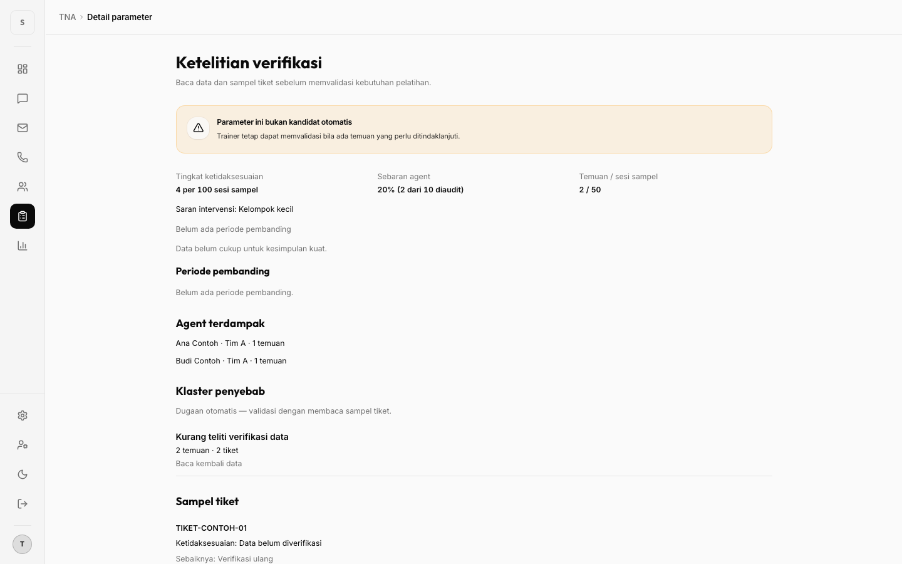
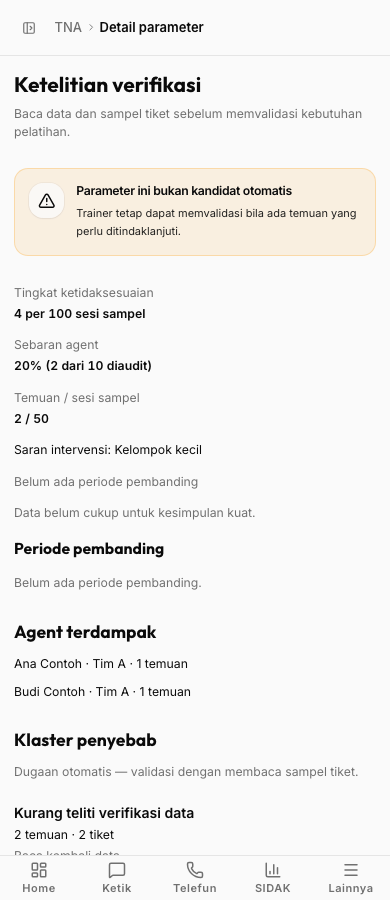

# TNA Fase 1 — Laporan T5

## Status

T5 selesai sesuai D7 rev. 7, **Lane D**. T6 belum dijalankan. Tidak ada commit, push, deploy, migrasi, atau perubahan backend/database pada T5. Dirty work T0–T4 dipertahankan.

## Kriteria UX sebelum implementasi

Skill `ui-ux-pro-max` dimuat sebelum menulis UI; acuan `DESIGN.md` → `docs/design.md`.

- Hirarki tugas: parameter → validasi trainer → kebutuhan → rencana.
- Tingkat berlabel **per 100 sesi sampel**; tanpa audit berarti belum tersedia, bukan nol.
- Klaster berlabel **Dugaan otomatis**, berbeda dari penyebab tervalidasi.
- Pratinjau draft jelas belum beku; baseline aktivasi dan peserta terkunci.
- Mobile satu kolom, form berlabel, aksi utama ≥44px, tanpa overflow horizontal halaman.
- State memuat, kosong, gagal + Coba lagi, sukses melalui tujuan/status terbaru; konflik 409 mengunci mutasi hingga muat ulang.
- Tidak menambah tab mobile, AI, evaluasi Fase 2, atau UI kelola katalog.

## Files / implementasi

- `apps/web/src/routes/tna/{index,parameter,need,plan}.tsx`: empat halaman lazy + guard `tna.read` di `apps/web/src/router.tsx`.
- `apps/web/src/routes/tna/{PlanForm,shared}.tsx`, `utils.ts`: form bersama, state, format angka/tren, dan penanganan HTTP 409.
- `apps/web/src/lib/app-config.ts`, `src/index.css`: APP_MODULES TNA + token light/dark `--module-tna`, `--module-tna-bg`.
- `apps/web/src/components/layout/{Sidebar,MobileDrawer}.tsx`, `nav-config.ts`: rail, drawer, state aktif, breadcrumb. **MobileTabBar.tsx tidak diubah.**
- `apps/web/e2e/tna-flow.spec.ts`, `helpers/tnaHarness.ts`: fixture bertipe kontrak asli `packages/types/src/tna.ts`; override sebelum default; preflight beforeAll; waitForMockedApi sebelum expectHermetic.
- `apps/web/e2e/design-token-contrast.spec.ts`: token TNA ditambahkan ke pengujian kontras kedua tema.

Pembacaan menggunakan `useApi` → **fetchApi yang berlaku**, tanpa mengganti transport/helper global. Mutasi memakai typed `rpcClient` (`hc<AppType>`) dan `unwrapResponse`, lewat transport auth yang sudah ada. PATCH/transisi memakai request option `init.body` karena route backend melakukan parsing JSON manual sehingga Hono belum menginfer input `json` untuk route berparameter; payload draft diperiksa dengan shared type/schema. Referensi Context7: `/honojs/hono/v4.13.0`, kontrak `ClientRequestOptions.init` (Hono terpasang 4.13.13). Tidak mengubah route API untuk mengatasi batas inference ini.

## RED → GREEN

1. RED: `pnpm --dir apps/web exec playwright test tna-flow.spec.ts --workers=1 --max-failures=1` → **exit 1**. Entri rail TNA belum ada, assertion `data-active=true` gagal. Log: `/tmp/tna-t5-red-focused.log`.
2. GREEN awal: alur lengkap + konflik + state + akses + responsif → **8 passed**. Log: `/tmp/tna-t5-green-3.log`.
3. Audit touch target: `pnpm --dir apps/web exec playwright test tna-flow.spec.ts -g 'responsif 390' --workers=1` → **exit 1**, tinggi tombol aktual **39px**. Root rem membuat `min-h-11` bukan 44px. Diganti dengan ukuran 44px eksplisit pada kontrol TNA, kemudian assertion offsetHeight lolos.
4. GREEN akhir: **27/27** untuk empat spec, satu worker, exit 0.

Catatan eksekusi: percobaan awal `pnpm --filter @trainers/web test:e2e -- tna-flow.spec.ts --workers=1 --max-failures=1` meneruskan `--` literal pada pnpm terpasang, sehingga runner memilih 517 tes, bukan spec fokus. Command terkena timeout 120 detik; tidak diklaim sebagai hasil verifikasi. Setelah memastikan proses runner sudah keluar, seluruh run berikutnya memakai `pnpm --dir apps/web exec playwright test ...` dengan filter yang terbukti (9/27 tes). Log percobaan awal: `/tmp/tna-t5-red.log`.

## Tests / verifikasi final

Semua command berikut dijalankan serial:

| Command | Hasil |
| --- | --- |
| `pnpm --dir apps/web exec playwright test tna-flow.spec.ts design-token-contrast.spec.ts authenticated-shell.spec.ts sidebar-nav-state.spec.ts --workers=1` | exit 0; **27 passed**: TNA 9, kontras 4, shell 11, sidebar 3 |
| `pnpm --dir apps/web typecheck` | exit 0; source + tsconfig.e2e |
| `pnpm --dir apps/web lint` | exit 0; 0 errors, 94 warnings pada file non-TNA |
| `pnpm --dir apps/web exec eslint src/routes/tna e2e/tna-flow.spec.ts e2e/helpers/tnaHarness.ts` | exit 0; tanpa warning |
| `pnpm --dir apps/web build` | exit 0; tsc + Vite production build |
| `GRAPHIFY_MAX_WORKERS=1 graphify update . --no-cluster` | exit 0; cache lokal, satu worker AST |

Log final: `/tmp/tna-t5-final-e2e.log`, `/tmp/tna-t5-typecheck.log`, `/tmp/tna-t5-lint-final.log`, `/tmp/tna-t5-scoped-lint.log`, `/tmp/tna-t5-build.log`, `/tmp/tna-t5-graphify.log`.

E2E membuktikan: rail/drawer trainer dan aktif di child route; breadcrumb; toggle semua parameter; drill-down non-kandidat; validasi; peserta pra-terisi; buat rencana; PATCH peserta + expected_updated_at; konfirmasi Aktifkan/Batalkan; pratinjau vs beku dan peserta terkunci; Ringkasan TNA; 409 + muat ulang; no_audit; nol temuan tidak bisa divalidasi; loading terkendali; kosong/gagal/retry; leader tanpa nav + redirect unauthorized; keempat halaman tidak overflow pada 1440 dan 390px.

Harness fail-closed hanya membolehkan aset Vite lokal, auth sintetis, dan API yang dimock. API nyata T1–T4 tidak dijalankan ulang pada T5. Tidak mengklaim imutabilitas database dari mock UI.

## Audit / polish Impeccable

**Verdict: PASS untuk scope T5.** Audit sumber dan inspeksi screenshot Chromium desktop/mobile; bukan audit independen atau sertifikasi WCAG menyeluruh.

- Context: `/Users/nadindyta/.pi/agent/skills/impeccable/scripts/impeccable context --target apps/web/src/routes/tna` → exit 0.
- Detector: `/Users/nadindyta/.pi/agent/skills/impeccable/scripts/impeccable detect --json apps/web/src/routes/tna apps/web/src/lib/app-config.ts apps/web/src/components/layout/Sidebar.tsx apps/web/src/components/layout/MobileDrawer.tsx apps/web/src/components/layout/nav-config.ts` → exit 0, `[]`.
- **P1 — parameter.tsx/index.tsx:** banner warning memakai teks amber bawaan yang terlalu terang di light. Diperbaiki lokal ke foreground token tanpa mengubah primitive lintas modul.
- **P2 — tna-flow.spec.ts:** screenshot mobile lama sempat menangkap konten sebelum selesai dimuat. Diperbaiki dengan menunggu heading setelah navigasi, dan menambah screenshot form setelah scroll.
- **P2 — parameter.tsx:** UUID pembanding bukan label operasional. Diperbaiki memakai metadata periode SIDAK; bila label metadata belum tersedia, label posisi pembanding, bukan UUID.
- **P2 — kontrol TNA:** touch target 39px terukur; diperbaiki menjadi ≥44px dan diverifikasi E2E.
- **P3 — shared.tsx:** warning fast-refresh baru karena campuran export komponen/utilitas. Dipisah ke `utils.ts`; scoped lint bersih.

Aksesibilitas 3/4, performa 3/4, responsif 3/4, theming 4/4, integritas 4/4: **17/20 (Good)**. Kontrol berlabel, focus native/primitive, dialog Base UI, token kedua tema teruji. Device emulation Chromium 390px, bukan perangkat fisik; gesture sentuh, screen reader, zoom ekstrem, dan seluruh state tema gelap belum diuji secara visual. Review kode `thermo-nuclear` terbatas pada T5; review seluruh diff T0–T5 tetap milik T6.

## Screenshot yang dapat diulang

Dihasilkan oleh dua test `responsif` pada run final. Screenshot adalah viewport shell karena area konten aplikasi memiliki scroll internal; screenshot validasi sengaja menggulir ke form. Semua data sintetis.

| Halaman | Desktop 1440×900 | Mobile 390×900 |
| --- | --- | --- |
| Parameter | [desktop](tna-phase-1-t5-desktop.png) | [mobile](tna-phase-1-t5-mobile.png) |
| Form validasi | [desktop](tna-phase-1-t5-desktop-validasi.png) | [mobile](tna-phase-1-t5-mobile-validasi.png) |
| Daftar | [desktop](tna-phase-1-t5-desktop-daftar.png) | [mobile](tna-phase-1-t5-mobile-daftar.png) |
| Kebutuhan | [desktop](tna-phase-1-t5-desktop-kebutuhan.png) | [mobile](tna-phase-1-t5-mobile-kebutuhan.png) |
| Rencana draft | [desktop](tna-phase-1-t5-desktop-rencana.png) | [mobile](tna-phase-1-t5-mobile-rencana.png) |

## Notes / batas tahap

Satu Vite web server milik task (`pnpm --dir apps/web dev --host localhost`) dipakai ulang; tidak menjalankan root `pnpm dev` atau server API tambahan. Server dihentikan setelah E2E; runner tidak tersisa. Tidak ada delegasi.

Root typecheck/lint/build, suite API real backend gabungan, dokumentasi database/auth, dan review seluruh diff **ditunda ke T6**, sesuai batas permintaan. Tidak ada STOP prerequisite T5 yang tersisa. `git add -N apps/web/src/routes/tna apps/web/e2e/tna-flow.spec.ts apps/web/e2e/helpers/tnaHarness.ts plans/markdown/tna-phase-1-t5-report.md plans/markdown/tna-phase-1.md plans/markdown/tna-phase-1-t5-*.png` lalu `git diff --check` → **exit 0**, mencakup file baru; tidak ada konten yang staged (`git diff --name-only --cached` kosong). Pemeriksaan `--no-index` sebelumnya mengembalikan 1 karena file berbeda dari `/dev/null`, tanpa diagnostik whitespace; gate resmi menggunakan intent-to-add di atas.
